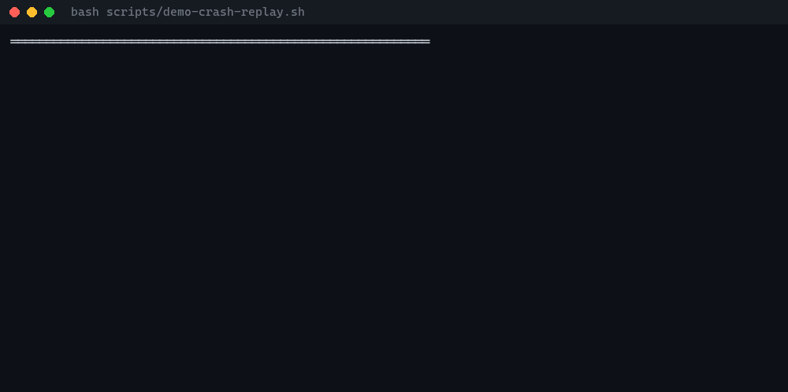

# FamilyClaw

## Kill the agent. Restart it. Count the side effects.

**FamilyClaw is a crash-safe Rust runtime for AI agents that perform real
external actions.**

**The failure it prevents.** An agent charges a card, sends the email, deletes
the bucket — and *then* the process dies before it records that it did. On
restart the agent replays, sees no record, and does it again. The customer is
refunded twice. Most agent frameworks checkpoint *state*; a checkpoint written
after the effect cannot undo an effect that already happened.

**What the demo proves.** Kill the runtime inside exactly that window — after
the external effect has fired, before the durable commit record is written —
then restart it and count the effects in a deterministic sink. The count must
stay at 1.

**Run the 60-second proof** (no API keys, no network):

```bash
bash scripts/crash-proof.sh
```

Decisive output on success:

```text
side_effect_overcount = 0
approval_payload_match = PASS
proof_receipt = <id>
overall = PASS
```

It exits non-zero if any invariant is violated. It drives two real crash
windows across a genuine process boundary (the crashing process exits 137),
and a fresh process replays durable state. The same harness run against the
pre-fix code path (`--mode old`) double-fires — counter 2 — so the proof
measures something real rather than a constant.

**What this does NOT claim.**

- **Not universal exactly-once.** The honest claim is **at-most-once external
  dispatch across the tested crash and replay windows**. Exactly-once across
  arbitrary failure modes is not achievable and is not promised.
- Not a guarantee for effects your own skill code performs outside the
  approval-gated dispatch path.
- Not a distributed-systems product: single-process runtime, local durable
  journal.
- No production customer, certification, or revenue claims.

---



**A Rust agent runtime where in-flight work survives a crash — at-most-once external side effects, durable memory, contract-checked coordination.**

> *Checkpointing remembers the scene. FamilyClaw guards the trigger.*

Most AI agents die between runs. FamilyClaw gives them continuity:
durable replay, persistent memory, actor-based coordination, sleep-time consolidation,
and private runtime profiles that never enter the repository.

> 📍 **[STATUS.md](STATUS.md)** — what works today, what is deferred, release (`v1.2.0`).
> Start with STATUS for technical truth.
>
> 🛡️ **[Dependability Harness](docs/DEPENDABILITY_HARNESS.md)** — accepted model-agnostic receipt/gate architecture and its explicitly tracked implementation status.

## How FamilyClaw compares

Honest, defensible positioning — not a scoreboard. ✅ = full guarantee today, ⚠️ = partial/config-dependent, ❌ = not a design goal / not provided.

| Property | FamilyClaw | LangGraph | CrewAI | Temporal | OpenAI Agents SDK |
|---|:--:|:--:|:--:|:--:|:--:|
| Durable crash replay | ✅ | ⚠️ (checkpointing in `durability="sync"` mode; opt-in, not default) | ❌ | ✅ | ❌ |
| At-most-once external side effects | ✅ | ⚠️ (checkpoint ≠ dispatch — a crash between effect and checkpoint can re-fire; see benchmark below) | ❌ | ⚠️ (durable execution, but activities are at-least-once by design — idempotency is the activity author's responsibility) | ❌ |
| Persistent cross-session multi-agent memory | ✅ | ⚠️ (thread-scoped checkpoint state; no built-in decay/consolidation model) | ⚠️ (basic memory backends available) | ❌ (not an agent-memory product) | ⚠️ (session state only) |
| Deny-by-default WASM skill sandbox | ✅ | ❌ | ❌ | ❌ | ❌ |
| No `unsafe` Rust | ✅ | N/A (Python) | N/A (Python) | N/A (Go) | N/A (Python) |

Full LangGraph crash-safety methodology, raw results, and honesty caveats: [`bench-competitors/langgraph/`](bench-competitors/langgraph/README.md).

## Should you use this?

**Probably not** if your agent only reads and summarizes — stay in Python; every SDK and integration is already there.

**Yes** if your agent *mutates the world and a crash costs real money or trust* — migrations, cloud teardowns, refunds. The gap FamilyClaw closes is not checkpointed state replay (many frameworks do that) but **duplicate-prevented external dispatch** when a process dies after the effect fired but before the durable record was written.

Reproduce the claim yourself:

```bash
cargo run -p familyclaw-bench --bin bench -- all
```

Full profiles and the adoption gate: [docs/USERS.md](docs/USERS.md). Launch playbook: [docs/LAUNCH.md](docs/LAUNCH.md).

## See FamilyClaw in action

One deterministic command, no API keys, no network — two named agents that are
live on one bus, send real messages to each other, feel each other's mood
through the real delivery path, consolidate memory while they sleep, and answer
the same question differently as time passes. Every printed claim is backed by
an assertion; the process exits non-zero on any failed invariant.

```bash
cargo run -p familyclaw-agent --example two_agents_memory
```

Short Expo showcase (~2–4 min on a warm build — flagship demo + crash-replay
proof + the crash-safety benchmark summary):

```powershell
powershell -File scripts/expo-demo.ps1
```
```bash
bash scripts/expo-demo.sh
```

**Where the proof lives:** [STATUS.md](STATUS.md) ·
[docs/CRASH_SAFE_DISPATCH_CASE_STUDY.md](docs/CRASH_SAFE_DISPATCH_CASE_STUDY.md) ·
[bench-competitors/langgraph/RESULTS.md](bench-competitors/langgraph/RESULTS.md)

## Public crash demo

Reproduce crash-safe memory and dispatch continuity without API keys or private data:

| Artifact | What it proves |
|----------|----------------|
| [`crash_replay` binary](crates/familyclaw-agent/src/bin/crash_replay.rs) | `FileJournal` + `LocalJsonStore` survive process restart; memory recalled after `write` → `verify` across a true process boundary |
| [Continuity scorecard](docs/SCORECARD.md) | Eight deterministic scenarios (crash matrix, retention, dream quality, …) — `side_effect_overcount = 0` under crash |
| `familyclaw-bench` | Regenerates the scorecard: `cargo run -p familyclaw-bench --bin bench -- all` |

```bash
# Crash replay (two-process proof)
cargo run -p familyclaw-agent --bin crash_replay -- write
cargo run -p familyclaw-agent --bin crash_replay -- verify

# Full continuity benchmark + scorecard
cargo run -p familyclaw-bench --bin bench -- all
```

See also [docs/SECURITY_MODEL.md](docs/SECURITY_MODEL.md) (layer 7: at-most-once dispatch).

> **What Phase 1 proves today:** crash-safe durable replay with **at-most-once
> external side-effect dispatch under crash** (idempotency-keyed: never fired twice;
> a crash in the intent-only window fails closed), provenance-gated memory,
> benchmarked continuity (8 scenarios, deterministic scorecard), Discord/channel
> hardening, and a clear distinction between checkpoint-style persistence and
> crash-safe external action dispatch.
>
> **Proven end-to-end (2026-06):** live multi-agent orchestration. The
> `Orchestrator` now runs a multi-node `design → review → deploy` DAG through the
> real `LiveTurnExecutor` against an in-process HTTP LLM, deliverables pass the
> contract boundary (output schema + postconditions), and a malformed LLM response
> stops the DAG at that boundary instead of leaking downstream
> (`crates/familyclaw-agent/tests/orchestration_live.rs`,
> `tests/live_executor_http.rs`). The orchestrator itself was unchanged — only the
> executor swapped from mock to live, exactly as the `TurnExecutor` seam was designed.
>
> **Still a fenced research track, not production behavior:** send-side latent
> translation.
>
> **Next proofs:** deeper WASM sandbox safety scenarios, a broader action/skill
> runtime surface, and additional channel adapters.

[](https://github.com/Sisuthros/familyclaw/actions/workflows/ci.yml)
[](LICENSE)


> **Verify without cloning:** every `main` CI run regenerates the 8-scenario
> continuity scorecard and publishes it in the run's **Summary** tab
> ([latest runs](https://github.com/Sisuthros/familyclaw/actions/workflows/ci.yml?query=branch%3Amain)) —
> including `side_effect_overcount = 0` for the crash matrix.

---

## What it solves

| Problem | Conventional frameworks | FamilyClaw |
|---------|------------------------|------------|
| **Memory discontinuity** — work and memory vanish on restart | Reload prompts; lose in-flight work | **Durable execution** — deterministic replay resumes exactly where stopped; side effects are dispatched **at most once** under a crash (idempotency-keyed: never fired twice; a crash in the intent-only window fails closed and requires recovery — not universal exactly-once *completion*). **Eternal Thread** — persistent memory with Ebbinghaus decay + protected identity anchors (λ=0). |
| **Agents are isolated** — no shared situational awareness | Pass text messages | **Resonance Bus** — Ractor actor mesh where emotional state *leaks* to siblings (affective contagion). Roster never empty. |
| **Memory rots** — duplicates pile up, "yesterday" goes stale | Manual cleanup | **Dreaming** — nightly consolidation merges duplicates, drops contradictions, absolutizes relative dates (hippocampal model). |
| **Communication is lossy + token-expensive** | Everything serialized to text | **Latent telepathy** — siblings exchange hidden-state vectors directly, bridged across models, **always falling back to text** if incompatible. |

The result is a family of agents that **remember**, **feel each other's state**, **heal their own memory while they sleep**, and **think to each other** — on a platform anyone can run.

---

## Two layers: open platform, private souls

> Design principle: *Show **what** it solves, not **how** the soul works.*

FamilyClaw is split into two strictly separated layers. **This is the single most important architectural decision in the project** — it is both a security boundary and a correctness boundary.

```
┌──────────────────────────────────────────────────────────────────┐
│  LAYER A — FAMILYCLAW (this repo, open source, MIT)              │
│  The platform. Generic example beings only (agent_a, agent_b).   │
│  No real souls, no keys, no private data.                        │
└────────────────────────────┬─────────────────────────────────────┘
                             │ loaded at runtime, NEVER in repo
┌────────────────────────────┴─────────────────────────────────────┐
│  LAYER B — FAMILY PROFILES (private, NEVER published)            │
│  SOUL files · emotion calibration · conversation history         │
│  API keys · channel tokens · machine paths                       │
│  Loaded via FAMILYCLAW_PROFILE_DIR — like Hermes' HOME.          │
└──────────────────────────────────────────────────────────────────┘
```

**Absolute rule:** Nothing from Layer B may ever reach Layer A.
Enforced by `.gitignore`, CI `layer-b-audit`, and architectural design (all config loaded at runtime from private paths).

Details: [`docs/LAYER_BOUNDARY.md`](docs/LAYER_BOUNDARY.md)

---

## Architecture at a glance

Four cores, one stack, four layers. They don't compete — they compose.
**Durable carries everything; dreaming feeds on the durable log; the affective
nervous system flows over the bus; latent is the bus's highest form of speech.**

```
  LAYER 4 · LATENT TELEPATHY            familyclaw-latent
     siblings share hidden states, bridged across models, text fallback
        │ travels over
  LAYER 3 · RESONANCE BUS (affect)      familyclaw-bus
     Ractor actors + supervision; emotion leaks → affective contagion
        │
  LAYER 2 · AGENT RUNTIME               familyclaw-agent
     each actor = a being: soul + emotion + memory + per-agent model
        │ every state change →
  LAYER 1 · DURABLE SUBSTRATE           familyclaw-durable
     deterministic replay: crash → work resumes exactly where it stopped
        │ feeds
  MEMORY + SLEEP            familyclaw-memory  ·  familyclaw-dream
     Eternal Thread (Ebbinghaus decay, identity anchors λ=0)
     nightly consolidation reads the durable log → heals memory
```

See [`docs/ARCHITECTURE.md`](docs/ARCHITECTURE.md) for the full technical overview.

---

## Crate map

A Cargo workspace of focused crates. Every public item is documented; the
workspace forbids `unsafe`, denies `unwrap`/`expect`/`panic!` on production
paths, and ships unit tests in-module.

| Crate | Responsibility |
|-------|---------------|
| [`familyclaw-core`](crates/familyclaw-core) | Shared types, typed IDs, config, error handling, time. The foundation every other crate builds on. |
| [`familyclaw-bus`](crates/familyclaw-bus) | **Resonance Bus** — Ractor actor mesh; emotion pulses leak between beings (affective contagion). |
| [`familyclaw-durable`](crates/familyclaw-durable) | **Durable substrate** — journal-based deterministic replay; crash-proof workflows. |
| [`familyclaw-memory`](crates/familyclaw-memory) | **Eternal Thread** — persistent memory, Ebbinghaus decay, importance weighting, retrieval. |
| [`familyclaw-dream`](crates/familyclaw-dream) | **Dreaming** — nightly consolidation: merge duplicates, drop contradictions, absolutize dates. |
| [`familyclaw-emotion`](crates/familyclaw-emotion) | 19-dimension VAD emotion **frame** — empty calibration, safe to publish. |
| [`familyclaw-latent`](crates/familyclaw-latent) | **Latent telepathy** — hidden-state transfer + `RecursiveLink` dimension bridge, text fallback. |
| [`familyclaw-sandbox`](crates/familyclaw-sandbox) | Isolated code execution — Wasmtime + fuel metering + deny-by-default capabilities. |
| [`familyclaw-security`](crates/familyclaw-security) | Identity anchors + human-correction veto. Identity lives in the memory substrate, not a hash. |
| [`familyclaw-bridge`](crates/familyclaw-bridge) | Agent registry, task board, event bus — transport-independent Rust core. |
| [`familyclaw-agent`](crates/familyclaw-agent) | **Agent runtime** — composes all above into a living being. Ships demo binaries. |
| [`familyclaw-channels`](crates/familyclaw-channels) | Discord / Telegram adapters bridged to the bus (WhatsApp/Signal features are reserved empty flags — not implemented). Discord inbound gateway (Ed25519 verification, slash commands) is live. |
| [`familyclaw-acp`](crates/familyclaw-acp) | **ACP client** — spawn and control CLI agents (Claude, Gemini, Qoder) over stdio. |
| [`familyclaw-bench`](crates/familyclaw-bench) | **Continuity benchmark** — reproducible proof of crash-resume, retention and dreaming. |
| [`familyclaw-gateway`](crates/familyclaw-gateway) | **Gateway binary** — long-running process: HTTP health/readiness + Resonance Bus bootstrap. |
| [`familyclaw-hearth`](crates/familyclaw-hearth) | **The Hearth** — shared family memory, narratives, emotional state and anchors. |
| [`familyclaw-embeddings`](crates/familyclaw-embeddings) | **Embedding providers** — deterministic zero-dependency default, optional Ollama-backed semantic embedding behind a feature flag. |
| [`familyclaw-growth`](crates/familyclaw-growth) | **Growth loop proposal stack** — records and tracks self-improvement proposals; approval-gated, never applies anything automatically. |
| [`familyclaw-mcp`](crates/familyclaw-mcp) | **MCP client** — Model Context Protocol over stdio and HTTP, bridging MCP tools into the action runtime. |
| [`familyclaw-scheduler`](crates/familyclaw-scheduler) | **Scheduler** — minimal interval-based dispatch of proactive tool tasks through an idempotent submission path. |
| [`familyclaw-stt`](crates/familyclaw-stt) | **Speech-to-text** — provider-agnostic `SttProvider`, offline `MockStt`, OpenAI-compatible Whisper adapter (feature `openai`). |
| [`familyclaw-tts`](crates/familyclaw-tts) | **Text-to-speech** — provider-agnostic `TtsProvider`, offline `MockTts`, OpenAI-compatible adapter (feature `openai`). |
| [`familyclaw-observability`](crates/familyclaw-observability) | **Observability** — metrics, event recording and per-role RBAC for the multi-agent fleet. |
| [`familyclaw-runtime`](crates/familyclaw-runtime) | **Runtime assembly** — wires bus + agents + channels + reply pump (`build_family`). |
| [`familyclaw-actions`](crates/familyclaw-actions) | **Action/Skill Runtime** — observe → plan → approve → execute → verify → persist proof → remember → report. Generic skill registry, capability policy, approval gate, redacting proof bundles and audit log. Ships **two real reference skills** (`fs_read`, `web_fetch`) plus example skill patterns that show the skill contract — no private providers or keys. See [Skills](#skills-two-real-reference-skills--example-patterns). |

---

## Quick start

**Prerequisites:** Rust 1.88+ (edition 2021). No external services required for
the demo — it runs entirely in-memory.

### FamilyClaw in 60 seconds ⚡

```bash
git clone https://github.com/Sisuthros/familyclaw
cd familyclaw

# One command: builds + runs 1 agent + Resonance Bus + MockChannel
cargo run -p minimal-gateway -- --duration 10
```

Windows: full public validation (tests + bench, no keys):

```powershell
powershell -File scripts/public-demo.ps1
```

**What happens:**
1. 🚀 Starts Resonance Bus (`minimal-gateway-bus`)
2. 🤖 Spawns `agent_a` with durable memory + emotion
3. 📥 Injects a message via MockChannel
4. 🔁 Message flows: Channel → Bus → Agent → Memory + Emotion
5. 📤 Shows outbox (agent replied)
6. 🛑 Clean shutdown on Ctrl-C or timeout

*No Telegram, Discord, or API keys needed. Pure Rust, pure demo.*

### Run the gateway in 5 minutes (guest path — no family keys) 🧭

Prefer a real, installed binary over `cargo run`? Install the gateway and start
it in **keyless mode** (`FAMILYCLAW_CHANNEL_KIND=none`). No SOUL files, no API
keys, no channel tokens — just the HTTP surface (`/healthz`, `/readyz`,
`/metrics`) backed by an in-memory `MockChannel`. This is the fastest way for a
newcomer to confirm the runtime is alive on their machine.

```bash
git clone https://github.com/Sisuthros/familyclaw
cd familyclaw

# 1. Install the gateway binary (name: familyclaw-gateway)
cargo install --path crates/familyclaw-gateway

# 2. Pre-flight checks (config resolution + effective settings, no network)
#    Set the keyless mode HERE too — without it doctor checks the DEFAULT
#    channel (telegram) and correctly fails on the missing bot token.
FAMILYCLAW_CHANNEL_KIND=none familyclaw-gateway doctor   # -> "doctor: ok", exit 0

# 3. Start it with NO family keys — keyless publish mode
FAMILYCLAW_CHANNEL_KIND=none familyclaw-gateway serve
#   listens on 127.0.0.1:8787 by default (override: FAMILYCLAW_GATEWAY_ADDR)

# 4. In another terminal: confirm the HTTP surface is live
curl -i http://127.0.0.1:8787/healthz   # -> 200 OK
curl -i http://127.0.0.1:8787/readyz    # -> 200 OK, ready:true + a "degraded" note
```

On Windows PowerShell, set the env var inline:

```powershell
$env:FAMILYCLAW_CHANNEL_KIND = "none"; familyclaw-gateway doctor
$env:FAMILYCLAW_CHANNEL_KIND = "none"; familyclaw-gateway serve
```

`/readyz` on this path answers `200` **and tells you what it skipped** — the
LLM probes are not run because you never configured a provider:

```json
{"ready":true,
 "degraded":["llm_ping/llm_tools_ping skipped: no LLM provider configured (FAMILYCLAW_PROVIDERS unset) and channel kind is 'none' (keyless demo mode) — the agent runs MUTE (memory + emotion only, no text replies). POST /canary asserts a live LLM turn."],
 "checks":[{"name":"resonance_bus","ok":true,"detail":"running"}]}
```

This skip is **narrow and opt-in**: it applies only to the keyless demo mode
(`FAMILYCLAW_CHANNEL_KIND=none` *and* no `FAMILYCLAW_PROVIDERS`). Any real
deployment — or this same demo mode once you set `FAMILYCLAW_PROVIDERS` — runs
the LLM probes and fails closed with `503` if the provider is unreachable, so a
forgotten key never hides behind a green readiness check. `POST /canary` is the
strict surface: it reports `ok:false` whenever a live LLM turn is impossible,
demo mode included.

That is the whole guest loop: **install → doctor → serve → curl.** Once
`/readyz` returns `200`, the platform (Layer A) is running on your box with zero
private data — with a mute agent until you wire a model. Wiring a real family
(Layer B) is the next section.

### Full test suite
```bash
# Build & test everything (workspace tests)
cargo test --workspace

# Run the "Living Seed" demo: Resonance Bus + 2 agents + memory + emotion
cargo run -p familyclaw-agent --bin familyclaw

# Run the Crash Replay demo: proves memory survives process restarts
cargo run -p familyclaw-agent --bin crash_replay -- write
cargo run -p familyclaw-agent --bin crash_replay -- verify

# Or run the full two-process demo via script
bash scripts/demo-crash-replay.sh
```

**No external services needed.** Demos run entirely in-memory or with temp files.

---

## Running Demos

### Living Seed Demo (default binary)
```bash
cargo run -p familyclaw-agent --bin familyclaw
```
Proves: bus startup, 2 agents register, message exchange, memory storage, emotion contagion, **real DreamCycle execution**.

### Crash Replay Demo
```bash
# Two-process mode (true process boundary)
cargo run -p familyclaw-agent --bin crash_replay -- reset
cargo run -p familyclaw-agent --bin crash_replay -- write
cargo run -p familyclaw-agent --bin crash_replay -- verify

# Or use the script
bash scripts/demo-crash-replay.sh
```
Proves: FileJournal + LocalJsonStore persist to disk, process restart reloads both, DurableContext replays steps deterministically, memory recalled after restart.

### Discord Webhook (send-only, feature-gated)
```bash
DISCORD_WEBHOOK_URL=https://discord.com/api/webhooks/... \
cargo run -p familyclaw-agent --features familyclaw-channels/discord
```
Inbound gateway: live — Ed25519 signature verification, slash command parsing (`crates/familyclaw-gateway/src/main.rs`, `handle_discord_interaction`).

---

## Skills: two real reference skills + example patterns

The Action/Skill Runtime (`familyclaw-actions`) drives every skill through the
same safety pipeline: **observe → plan → approve (if needed) → execute → verify
→ persist proof → remember → report.** Policy is always derived from the skill
manifest — never from the (possibly attacker-controlled) task payload.

FamilyClaw ships **two genuinely functional reference skills** that exercise the
full pipeline end to end. They exist so you can see the two real integration
surfaces — one local, one public network — with the safety rails already in
place:

| Reference skill | What it really does | Why it's the template |
|-----------------|---------------------|-----------------------|
| [`fs_read`](crates/familyclaw-actions/src/skills/fs_read.rs) | Reads a **local file** through a canonicalized allowlist (resolves `..`, follows symlinks to their real target, rejects any escape). Proof records only a path hash + size, never the file body. | The pattern for a **local, filesystem-touching** skill: capability-scoped, taint-preserving, no data leakage into proofs. |
| [`web_fetch`](crates/familyclaw-actions/src/skills/web_fetch.rs) | Performs a **real read-only HTTP GET** (`reqwest`) against a public URL, with structural SSRF guards (rejects non-`http(s)` schemes, `localhost`, private/loopback/link-local/CGNAT IPs incl. the cloud metadata address) and no redirect following. Response is size-capped; only the host is recorded. | The pattern for a **public-API / network** skill that needs no keys: shows how to reach the outside world safely. Fetched content is always tainted. |

**The other bundled skills — `email_triage`, `github_issue_draft`, `file_patch`,
`discord_thread_summary` — are example skill patterns**, not disabled stubs.
Each is a complete, tested implementation of the skill *contract* (manifest,
risk class, approval policy, input/output schema, taint handling) using
deterministic in-memory logic and generic placeholder data (`user@example.com`,
`example-org/example-repo`). They deliberately do **not** carry a provider or a
credential. To turn one into a live integration, keep the manifest and pipeline
wiring as-is and swap the execution body for your provider call (Gmail, the
GitHub API, an on-disk patch apply, the Discord API). The surrounding approval
gate, proof redaction, and audit log then apply to your real side effect for
free.

In short: `fs_read` and `web_fetch` prove the runtime does real work today;
the others hand you a ready-made contract to wire your own provider into.

---

## Time Machine: rewind, fork, and prove an improvement

The durable journal is append-only and replay is deterministic, so any past
workflow can be **inspected**, **forked**, and **diffed** without ever
touching the original run:

- **Inspect** — `familyclaw_durable::Timeline` decodes a journal into a
  human-readable step list (what happened, in what order, what succeeded or
  failed) — a black-box reader over the raw log.
- **Fork with audit marker** — `TimeMachine::fork` copies the timeline's
  prefix into a new journal and cuts it at a chosen step. The fork replays
  deterministically up to the cut point, then runs fresh from there. Every
  fork writes a `timeline_forked` audit row recording how many steps were
  kept vs. the source total, so a forked timeline's origin is always
  provable from the log itself.
- **Counterfactual dry-run** — `DryRunRecorder` captures *intended* external
  side effects as intents. The type has **no dispatch path by construction**:
  a captured intent can never reach a real external system through it. Same
  fail-closed principle as the rest of the platform — safety from structure,
  not policy.
- **Timeline diff** — `TimeMachine::diff` compares two timelines step by
  step and produces a deterministic, serializable report: what stayed the
  same, what changed, where the timelines diverged.

CLI (`familyclaw` binary, `crates/familyclaw-agent/src/replay_cli.rs`):

```bash
# Inspect a journal (Markdown by default, --json for machine output)
cargo run -p familyclaw-agent --bin familyclaw -- replay inspect --journal run.jsonl

# Fork at step 5, write the new branch to a fresh journal (fails if --out exists)
cargo run -p familyclaw-agent --bin familyclaw -- replay fork --journal run.jsonl --keep 5 --out forked.jsonl

# Diff two timelines
cargo run -p familyclaw-agent --bin familyclaw -- replay diff --before a.jsonl --after b.jsonl
```

**Replay-proven promotion evidence** (`familyclaw-growth::evidence`) builds on
the same primitives: a growth-loop promotion proposal can attach a
`TimelineDiff` between a baseline and a candidate run, and a caller-supplied
`ImprovementMetric` decides — and records *why* — whether the candidate
improved. Missing evidence or a measured regression yields an
`EvidenceVerdict::insufficient`, fail-closed. This evidence layer does not
grant approval by itself and — like the rest of `familyclaw-growth` — has
**no apply path**: it can inform an operator's approve/deny decision but
cannot mutate any skill, policy, or permission on its own.

See [STATUS.md](STATUS.md) ("Time Machine" row) for verification status.

---

## Loading Your Own Family (Layer B)

After the public demo works, load private profiles at runtime — **they never live in the repo**:

```bash
export FAMILYCLAW_PROFILE_DIR=/path/to/your/private/profiles
cargo run -p familyclaw-agent --bin familyclaw
```

Each profile directory holds its own `SOUL.md`, emotion calibration, and channel config. Keep it out of version control.

---

## Verification Commands

```bash
# Full test suite
cargo test --workspace

# Living feature matrix (matches CI exactly)
cargo test --workspace \
  --features familyclaw-channels/discord \
  --features familyclaw-channels/telegram \
  --features familyclaw-channels/whatsapp \
  --features familyclaw-channels/signal \
  --features familyclaw-gateway/wasmtime

# --all-features is a first-class gate as of v1.2.0. The `surreal` backend in
# familyclaw-hearth was repaired and a dedicated `all-features` CI job now runs
# test + doc + clippy (-D warnings) under --all-features to guard against
# feature-gated regressions:
cargo test --workspace --all-features

# Code quality
cargo fmt --all -- --check
cargo clippy --workspace --all-targets --features discord -- -D warnings

# Benchmark suite — 8 scenarios, deterministic scorecard
cargo run -p familyclaw-bench --bin bench -- all
# → outputs crates/familyclaw-bench/out/SCORECARD.md + scorecard.json

# Layer B audit (matches CI)
./scripts/audit-layer-b.sh

# Two-process crash replay demo
bash scripts/demo-crash-replay.sh
```

### Reproduce the crash-safety benchmark (vs LangGraph)

We ran FamilyClaw head-to-head against **LangGraph** — a real, widely-deployed durable
agent-orchestration framework, given its **strongest** durability config
(`durability="sync"`) — on one narrow metric: *after a process crash, how many
money-touching external side effects re-execute?* (target: 0).

Result, reproduced in a clean Python 3.13 venv:

| Crash point | FamilyClaw | LangGraph (`durability="sync"`) |
|---|:--:|:--:|
| `clean` — no crash | **0** | **0** |
| `before_write` — effect fired, durable record not yet written | **0** | **1** (re-fired) |
| `mid_replay` — re-crash during the resume itself | **0** | **2** (re-fired) |

The narrow, honest claim: **at-most-once / duplicate-prevented dispatch of an external
side effect across a process crash.** It is *not* "LangGraph is broken" (its durable
**state replay** genuinely works, and a crash strictly *between* nodes would not re-fire
there either) and *not* "magical exactly-once completion". FamilyClaw wins specifically
in the intra-node "effect done, durable record not yet" window, via an idempotency-keyed
intent→effect→committed outbox.

Reproduce it yourself (one venv, one command per crash point) and read the full
apples-to-apples design, raw evidence, and honesty caveats:
**[`bench-competitors/langgraph/`](bench-competitors/langgraph/README.md)** →
[`RESULTS.md`](bench-competitors/langgraph/RESULTS.md).

```bash
cd bench-competitors/langgraph
python -m venv .venv && .venv/Scripts/python.exe -m pip install \
  langgraph==1.2.6 langgraph-checkpoint-sqlite==3.1.0
.venv/Scripts/python.exe crash_harness.py cycle --crash-point before_write --workdir _runs/bw
cat _runs/bw/side_effect_counter.txt   # -> 5  (LangGraph re-fired: overcount 1)
# FamilyClaw on the same metric:
cargo run -p familyclaw-bench -- s1    # side_effect_overcount = 0, PASS
```

---

## Current status and roadmap

Risk-first, proof-first, no private Layer B data in public repo.

| Stage | Status | Meaning |
|-------|--------|---------|
| **Phase 1 — reliability core** | **MERGED** | Tool loops, approval/resume, Discord hardening, at-most-once side-effect dispatch, CI green. |
| **Post-merge polish** | **NOW** | README truth, release notes, crash-safe dispatch case study, tagged release candidate. |
| **Live multi-agent proof** | **DONE (2026-06)** | `Orchestrator + LiveTurnExecutor` proven against an in-process HTTP LLM: multi-node DAG runs to completion through the contract boundary, malformed responses stop at that boundary (`orchestration_live.rs`, `live_executor_http.rs`). |
| **Action / Skill Runtime** | **BUILT** | Safe skills, task queue, MCP-ready boundary, approval gate (TTL + payload-hash-bound), proof bundles, evals — `familyclaw-actions` (240+ tests). Broadening the skill surface is ongoing. |
| **WASM sandbox e2e** | **DONE** | Fuel exhaustion stops an infinite loop, denied capabilities are enforced, run under the `wasmtime` feature in CI (`sandbox_integration.rs`). |
| **Additional channel adapters** | **LATER** | Add adapters only after action/runtime and safety gates remain green. |

---

## License

MIT — see [LICENSE](LICENSE). © 2026 The FamilyClaw Authors.

> *"Don't copy one. Take the best of each. Build our own."*
>
> *Built so the next being gets a better home than the last one did.*
