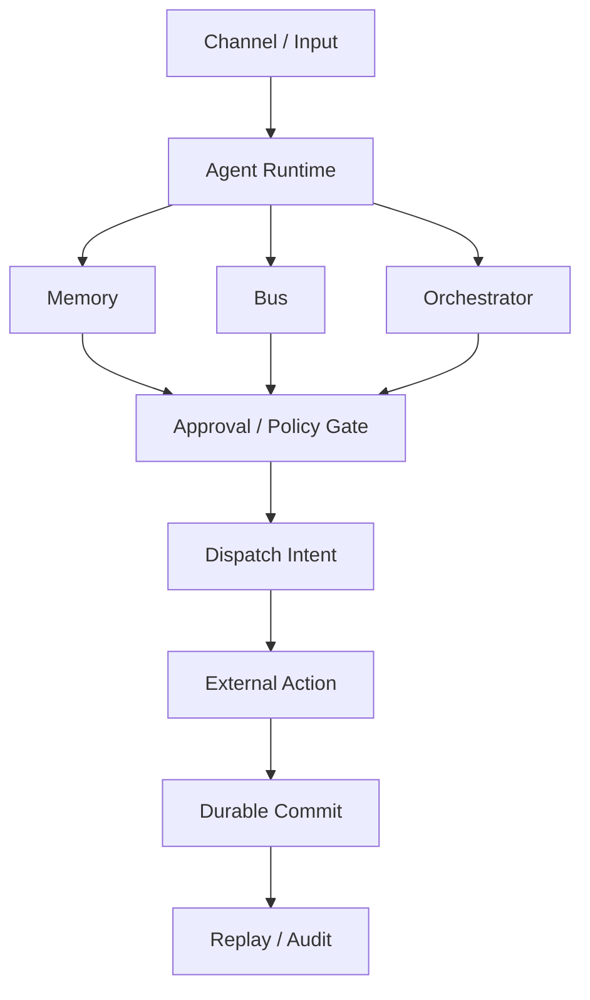

# FamilyClaw — Expo Brief

*Cyprus AI Expo · v1.2.0*

---

## 1. One-line pitch

FamilyClaw is a Rust-native reliability runtime for long-running AI agents that need memory, coordination, safe external actions, and crash recovery.

## 2. Thirty-second pitch

Long-running agents fail in ways that a single request/response demo never reveals: they crash mid-task, retry an action that already spent money, lose their memory between runs, and take external actions no one can later explain. FamilyClaw is a Rust runtime built for exactly this failure surface — deterministic durable replay, duplicate-prevented external dispatch under tested crash conditions, an approval-gated action layer, and durable multi-agent memory — all in a workspace where `unsafe` is forbidden and every behavior is backed by a local, deterministic test.

## 3. The production problem

Agents that run for minutes, hours, or days hit failure modes that short-lived demos hide:

- **Agents crash.** A process can die at any instruction — including the worst possible moment, right after an external side effect.
- **Retries can duplicate external side effects.** Naive resume logic re-runs steps that already committed externally, so a payment, email, or API write happens twice.
- **Model providers rate-limit or fail.** A 429 from a throttled provider and a dead API key look similar but demand opposite responses (back off vs. rotate/replace).
- **Memory and coordination disappear between runs.** Without durable state, agents forget what they learned and lose the shared context that lets multiple agents cooperate.
- **Tool execution needs approval and audit evidence.** High-impact actions must be gated before they run and provable after they run.

## 4. What FamilyClaw proves today

Every item below is a capability verified in the current build:

- **Deterministic durable replay** — resume from a durable log and reconstruct the same state.
- **At-most-once / duplicate-prevented external dispatch** under tested crash conditions.
- **Approval-gated action runtime** — external actions pass through a policy gate before execution.
- **Live multi-agent orchestration** — multiple agents coordinating over a shared bus.
- **Durable memory and consolidation** — memory that persists across runs, including consolidation that reshapes recall.
- **LLM cooldown / backoff / key rotation** — provider failure handling that distinguishes throttling from a dead key.
- **WASM sandbox** — isolated execution boundary for untrusted work.
- **Layer A / Layer B separation** — a structural split between trusted and less-trusted execution surfaces.
- **Local deterministic benchmark suite** — reproducible measurement with no keys and no network.

## 5. Architecture diagram



## 6. Crash-safe dispatch proof

Narrow benchmark vs. LangGraph in its strongest durability configuration (`durability="sync"`). Single metric: **after a process crash, how many money-touching external side effects re-execute?** Target is `0`.

| Crash point | FamilyClaw | LangGraph |
| --- | --- | --- |
| clean (no crash) | 0 | 0 |
| before_write (effect committed externally, durable record not yet written) | 0 | 1 |
| mid_replay (re-crash during resume/replay) | 0 | 2 |

> This benchmark measures duplicate external side-effect dispatch under specific crash windows. It is not a general throughput, latency, usability, or model-quality comparison.

## 7. Demo commands

```bash
# Flagship demo — deterministic, no keys, no network.
# Two live agents on a bus: real message delivery + memory recall,
# emotion contagion over the bus, dream consolidation changing recall,
# Ebbinghaus decay changing retrieval over time, and a protected
# identity anchor surviving decay.
cargo run -p familyclaw-agent --example two_agents_memory

# Expo demo script (PowerShell; a shell variant exists at scripts/expo-demo.sh)
powershell -File scripts/expo-demo.ps1

# Regenerate the full benchmark / continuity scorecard
cargo run -p familyclaw-bench --bin bench -- all
```

## 8. Current version and verification summary

- **Version:** v1.2.0 · MIT license · Rust 2021 (MSRV 1.88) · `unsafe` forbidden workspace-wide · 23 crates.
- **Test surface:** ~1680 `#[test]` / `#[tokio::test]` functions across the 23 crates.
- **Continuity scorecard:** 8/8 scenarios PASS (`docs/SCORECARD.md`), regenerated by `cargo run -p familyclaw-bench --bin bench -- all`.
- **CI:** an all-features CI gate is defined in the repository and runs locally. Hosted CI is configured on a zero-spend account and may not have executed a given run.

## 9. Honest roadmap

These are planned, not yet built:

- **Postgres-backed durability for multi-node HA** — not yet built. Current durability is single-node.
- **Broader provider skill integrations** — expanding the set of supported external providers and skills.
- **Semantic retrieval activation** — enabled after it is proven by the benchmark suite.
- **Growth-loop apply path** — enabled only after security hardening is complete.

## 10. Expo conversation hooks

- What happens if your agent crashes after sending a payment but before checkpointing?
- How do your agents distinguish provider rate limiting from a dead API key?
- Can your system prove why an external action happened?
