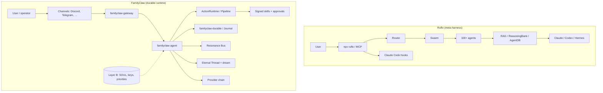

# Ruflo vs FamilyClaw — kartoitus

> **Tarkoitus:** Selvittää, mitä [Ruflo](https://github.com/ruvnet/ruflo) (agent meta-harness Claude Code / Codex -ympäristöön) tarjoaa, miten se suhteutuu FamilyClawiin, ja mitä kannattaa lainata vs. hylätä.
>
> **Päivämäärä:** 2026-07-08  
> **Konteksti:** Julkinen Layer A -repo + yksityinen Layer B -profiili (esim. Discord-operaattori-DM).  
> **Liittyvät docit:** [ARCHITECTURE.md](./ARCHITECTURE.md) · [LAYER_BOUNDARY.md](./LAYER_BOUNDARY.md) · [SECURITY_MODEL.md](./SECURITY_MODEL.md) · [COMPARISON.md](./COMPARISON.md)

---

## 1. Tiivistelmä

| | **Ruflo** | **FamilyClaw** |
|---|-----------|----------------|
| **Ydinlupaus** | “Agent = Model + Harness” — 100+ agenttia, swarmit, self-learning | Crash-safe runtime — durable replay, at-most-once ulkoiset side-effectit |
| **Pino** | TypeScript/Node + pluginit; Rust-kernel (WASM/NAPI) MetaHarness-suunnassa | Rust-first workspace (agent, durable, actions, gateway, channels) |
| **Kohdeyleisö** | Claude Code / Codex / Hermes -käyttäjät, npm-ekosysteemi | Operaattorit, jotka tarvitsevat **todistettavaa** käyttäytymistä tuotannossa |
| **Muisti** | RAG, ReasoningBank, SONA, graph hops | Eternal Thread, provenance gate, dream cycle, semanttinen recall |
| **Turva** | Enterprise guardrails (markkinointitaso) | 8 kerrosta, fail-closed approvalit, manifest-pohjainen policy |
| **Moni-agentti** | Swarm-topologiat (hierarkia, mesh, federation) | Resonance Bus + `spawn_subagent` |
| **Onboarding** | `npx ruflo init`, plugin marketplace, lite vs full | `familyclaw-gateway doctor`, `init`-wizard, expo-demo |

**Johtopäätös:** Ruflo on **laaja harness-tuote** IDE/CLI-hosteille. FamilyClaw on **durable agent runtime** kanavilla ja approval-putkella. Ne eivät ole suoria kilpailijoita — mutta Ruflon **rakenteelliset** ideat (kernel vs sisältö, host-adapterit, progressiivinen onboarding) ovat opittavissa. Ruflon **pinta-alue** (swarm-hype, aggressiivinen self-learning) on FamilyClawille riski, ei etu.

---

## 2. Arkkitehtuurinen vastine

### 2.1 Termistön kartta

| Ruflo-käsite | FamilyClaw-vastine | Huomio |
|--------------|-------------------|--------|
| Harness | `familyclaw-gateway` + `familyclaw-agent` + `familyclaw-actions` | Meillä harness on runtime, ei npm-plugin |
| Kernel (`@metaharness/kernel`) | Layer A -cratet (`durable`, `actions`, `bus`, `memory`) | Sama ajatus: ydin erillään brändistä |
| Plugin / skill | `Skill` + `SkillManifest` + registry | Policy manifestista, ei payloadista |
| Host adapter | `familyclaw-channels` (Discord, Telegram, …) | Ohut adapteri; logiikka agentissa |
| Memory namespace | Layer B `data/` + provenance tags | Ei commitoida repoon |
| `npx ruflo init` | `doctor` + profiilin env | Voimme selkeyttää “lite vs full” -polun |
| Swarm | `spawn_subagent` + Resonance Bus | Tarkoituksella kapeampi |
| Federation / comms | Ei vastinetta (tahallisesti) | Ei ennen kuin yksi agentti on luotettava |
| Self-learning loop | `dream_skill`, recall | **Ei** automaattista “opettele onnistuneista malleista” ilman guardia |
| Witness / provenance | Ed25519 skillit, proof bundles | Jo linjassa SECURITY_MODEL.md:n kanssa |

---

## 3. Mitä meillä on jo (Ruflo-linssin läpi)

### 3.1 Reliability (FamilyClawin erottelu)

| Ominaisuus | Crate / moduuli | Ruflo-vastine |
|------------|-----------------|---------------|
| Crash-safe replay | `familyclaw-durable`, `FileJournal` | Ei korostettu |
| At-most-once ulkoiset side-effectit | `familyclaw-actions` pipeline + idempotency | Ei korostettu |
| Turn-watchdog (ei hiljaista timeoutia) | `familyclaw-agent/watchdog.rs` | Autopilot-loop eri filosofialla |
| Syvä `/readyz` | `familyclaw-gateway/readiness.rs` | Health checks pluginissa |
| Kanarialintu `POST /canary` | `readiness.rs` | Daemon health |
| Approval-jumien siivous | `cleanup_stale_approval_tasks` + `doctor --fix` | Ei vastaavaa dokumentoitua polkua |

### 3.2 Työkalut ja integraatiot

| Skill / ominaisuus | Tila | Ruflo-vastine |
|--------------------|------|---------------|
| `fs_read` / `file_write` (allowlist) | Valmis | Filesystem plugins |
| `shell_exec` (off/smart/manual + blocklist) | Valmis | Sandbox / terminal plugins |
| `web_fetch` / `web_search` | Valmis | Browser / search plugins |
| `file_patch` / `file_patch_apply` | Valmis (oikea toteutus) | Code plugins |
| `github_issue` | Valmis | GitHub plugins |
| `schedule_task` + cron scheduler | Valmis | `ruflo-loop-workers` |
| `spawn_subagent` | Valmis | `ruflo-swarm` (kevyempi) |
| MCP-client (`familyclaw-mcp`) | Valmis crate | Ruflo MCP server (314 työkalua) |
| LLM streaming + Discord edit | Valmis | UI beta (flo.ruv.io) |

### 3.3 Operaattori-UX (tuore)

| Ominaisuus | Moduuli | Miksi tärkeää |
|------------|---------|---------------|
| Identity guard (`FAMILYCLAW_OWNER_ID`) | `identity.rs` | Estää roolipelinimen vuodon recallista |
| Operator capability rules | `identity.rs` | Ei `shell_exec` analyysiin; tekninen tyyli |
| Brief-ping fast path | `agent.rs` | Lyhyt ack ilman LLM:ää |
| Operator diagnostic fast path | `agent.rs` + `identity.rs` | P0/P1/P2 ilman esseitä |
| Memory filter operator-turneille | `identity.rs` | Suodattaa fiction-recallin |

### 3.4 Turva ja rajat

| Kerros | Dokumentti / toteutus |
|--------|----------------------|
| Layer A / Layer B | `LAYER_BOUNDARY.md`, `scripts/audit-layer-b.sh` |
| 8 defense layers | `SECURITY_MODEL.md` |
| Fail-closed approvals | `familyclaw-actions/approval` |
| WASM sandbox (valinnainen) | `familyclaw-sandbox` + `wasmtime` feature |

---

## 4. Mitä Ruflosta kannattaa lainata

Priorisoitu lista — **ei kopioi koodia**, vaan **malleja**.

### P0 — Heti hyödyllistä

| Idea | Ruflo-esimerkki | FamilyClaw-toimenpide |
|------|---------------|----------------------|
| **Kernel vs sisältö -tarina** | MetaHarness: `@metaharness/kernel` + branded harness | Dokumentoi ja myy: *Layer A = kernel, Layer B = profiili* (jo olemassa, vahvista viestintä) |
| **Deterministiset operator-polut** | Hooks reitittävät taustalla | Laajenna fast path -kuvio: diagnoosi, status, “jatka” → ei LLM ellei tarpeen |
| **Lite vs full install** | Plugin-only vs `npx ruflo init` | `doctor` → smoke (`healthz`) → deep (`readyz`) → full (channels + LLM + skills) |
| **Host-adapter ohut** | Claude Code / Codex / Hermes adapter | Pidä `familyclaw-channels` ohuesta; älä siirrä policyä channeleihin |

### P1 — Seuraava aalto

| Idea | Ruflo-esimerkki | FamilyClaw-toimenpide |
|------|---------------|----------------------|
| **Harness factory -ajattelu** | `agent-harness-generator` | `familyclaw init` generoi Layer B -profiilin (SOUL-pohja, env, allowlistit) — ei 60 agenttia |
| **Skill marketplace -meta** | 35 pluginia, manifestit | Julkaise skill-signing + manifest-skeema “third-party skill pack” -tarinaan |
| **Trajectory / reasoning bank** | ReasoningBank, SONA | **Rajattu** versio: tallenna vain *hyväksytyt* operator-diagnostiikat proof-journaliin, ei vapaa self-learning |
| **Multi-host MCP** | Sama kernel, eri host | `familyclaw-mcp` bridge → ActionRuntime; dokumentoi “MCP in, skill out” |

### P2 — Myöhemmin, jos tarve

| Idea | Ruflo-esimerkki | FamilyClaw-toimenpide |
|------|---------------|----------------------|
| **Federation** | `ruflo-federation` | Vain jos useampi gateway-instanssi tarvitsee turvallista työnjakoa |
| **Graph RAG** | `ruflo-knowledge-graph` | Eternal Thread + graph vain jos recall-laatu vaatii |
| **Local LLM routing** | `ruflo-ruvllm` | Provider chain jo olemassa; lisää eksplisiittinen “local fallback” -polku |

---

## 5. Mitä hylätään eksplisiittisesti

| Ruflo-suunta | Miksi ei FamilyClawiin | Mitä teemme sen sijaan |
|--------------|------------------------|------------------------|
| **100+ geneeristä agenttia** | Pinta > luotettavuus; roolipelivuoto, approval-loopit | Pieni allekirjoitettu skill-setti; domain-spesifit taidot Layer B:ssä |
| **Swarm-topologiat (mesh, consensus)** | Monimutkaisuus ennen yhden agentin vakautta | `spawn_subagent` rajattuna; bus vain kun tarve todistettu |
| **Aggressiivinen self-learning** | Recall sekoittaa fiction + fakta (nähty tuotannossa) | Provenance gate + operator memory filter + deterministiset fast pathit |
| **314 MCP-työkalua** | Hyökkäyspinta, hämmentää mallia | MCP → skill wrapper; allowlistatut työkalut |
| **npm/Node-first runtime** | FamilyClawin USP on Rust + crash-safety | Pidä Node vain esimerkeissä / bridgeissä tarvittaessa |
| **Starit/lataukset uskottavuutena** | 60k+ tähteä, 0 forkia — markkinointisignaali | Mittaa `side_effect_overcount`, scorecard, crash_replay |
| **“Autopilot loop” ilman approval-rajoja** | Rikkoisi SECURITY_MODEL layer 2 | Autonomia vain low-risk + eksplisiittinen policy |

---

## 6. Opetukset operaattori-DM:stä (Layer B, geneerisesti)

Nämä eivät ole Ruflo-spesifejä, mutta kartoitus selitti **miksi** Ruflo-tyylinen laaja pinta pahentaa niitä:

| Ongelma | Juurisyy | FamilyClaw-vastaus | Ruflo pahentaisi? |
|---------|----------|-------------------|-------------------|
| Hiljaisuus / timeout | LLM-ketju jumittaa | Turn-watchdog + selkeä virheviesti | Autopilot-loop voi pitkittää |
| Esseet diagnoosissa | Heikko prompt + ei fast pathia | `operator_diagnostic_reply()` | 100 agenttia = enemmän ääniä |
| Väärä nimi (fiction) | Semanttinen recall | Identity guard + memory filter | RAG/graph recall lisää riskiä |
| `shell_exec` approval-jumi | LLM valitsi väärän työkalun | Capability rules + smart shell | Enemmän työkaluja = enemmän virheitä |
| “Mitä seuraavaksi?” | Avoin lopetus kehotteessa | Kielletty guardissa | Swarm-koordinaatio rohkaisee jatkoa |

**Operaattoritila** = engineering mode: P0/P1/P2, konkreettiset korjaukset, ei rooliprosaa. **Persona-tila** = Layer B SOUL, erillinen kanava/konteksti.

---

## 7. Gap-analyysi (nykytila)

| Alue | FamilyClaw | Ruflo | Gap / toimenpide |
|------|------------|-------|------------------|
| Crash-safety | Vahva, benchmarkattu | Heikosti dokumentoitu | **Pidä etu** — demo scorecard |
| IDE-integraatio | Gateway + channels | Claude Code natiivi | Harkitse ohut “Cursor/Claude plugin” myöhemmin |
| Onboarding < 5 min | `doctor`, expo-demo | `npx ruflo init` | Selkeytä 3-portainen polku (smoke/deep/full) |
| Muisti / RAG | Eternal Thread | Graph RAG, hybrid search | Ei kiire; provenance tärkeämpi |
| UI | Discord-viestit | flo.ruv.io beta | Ei prioriteetti |
| Multi-machine | Ei | Federation | Hylätty toistaiseksi |
| Skill-ekosysteemi | Sisäänrakennetut + signing | 35 npm-pluginia | Dokumentoi “skill pack” -formaatti |
| Operator determinism | Fast pathit (uusi) | Hooks (tausta) | **Testaa ja laajenna** fast path -luetteloa |

---

## 8. Ehdotettu tiekartta (FamilyClaw-spesifinen)

### P0 (1–2 viikkoa)

- [ ] Vahvista operator diagnostic fast path tuotannossa (yksi testikysymys deployn jälkeen)
- [ ] Dokumentoi `doctor` → smoke → deep → full -polku QUICKSTARTiin
- [ ] Fast path -luettelo: ping, status, diagnoosi, “jatka viime tehtävä”

### P1 (1 kk)

- [ ] `familyclaw init` generoi minimaalisen Layer B -profiilin (geneeriset nimet)
- [ ] Rajattu “operator journal”: vain hyväksytyt diagnoosit / korjaukset muistiin
- [ ] MCP-työkalujen allowlist per profiili

### P2 (myöhemmin)

- [ ] Valinnainen graph-recall Eternal Threadin päälle
- [ ] Federation vain jos multi-gateway tarve todistettu

---

## 9. Viitteet

| Lähde | URL |
|-------|-----|
| Ruflo | https://github.com/ruvnet/ruflo |
| MetaHarness / agent-harness-generator | https://github.com/ruvnet/metaharness |
| Ruflo README (kernel, plugins, learning loop) | https://github.com/ruvnet/ruflo/blob/main/README.md |
| FamilyClaw security | [SECURITY_MODEL.md](./SECURITY_MODEL.md) |
| FamilyClaw continuity proof | [COMPARISON.md](./COMPARISON.md) · [SCORECARD.md](./SCORECARD.md) |

---

## 10. Yksi lause tiimin käyttöön

> **Ruflo opettaa rakentamaan laajan harness-pinnan; FamilyClaw voittaa todistamalla, että agentti ei kuole, ei toista side-effectejä, eikä vuoda fictionia operaattorille — vähemmän magiaa, enemmän invariantteja.**
