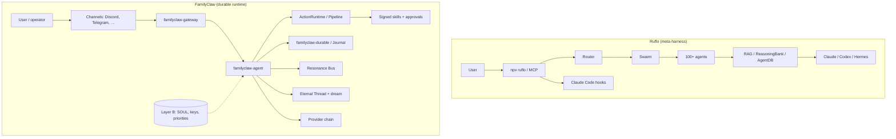

# Ruflo vs FamilyClaw — mapping

> **Purpose:** Determine what [Ruflo](https://github.com/ruvnet/ruflo) (agent meta-harness for Claude Code / Codex environments) offers, how it relates to FamilyClaw, and what is worth borrowing vs. discarding.
>
> **Date:** 2026-07-08  
> **Context:** Public Layer A repo + private Layer B profile (e.g. Discord operator DM).  
> **Related docs:** [ARCHITECTURE.md](./ARCHITECTURE.md) · [LAYER_BOUNDARY.md](./LAYER_BOUNDARY.md) · [SECURITY_MODEL.md](./SECURITY_MODEL.md) · [COMPARISON.md](./COMPARISON.md)

---

## 1. Summary

| | **Ruflo** | **FamilyClaw** |
|---|-----------|----------------|
| **Core promise** | "Agent = Model + Harness" — 100+ agents, swarms, self-learning | Crash-safe runtime — durable replay, at-most-once external side effects |
| **Stack** | TypeScript/Node + plugins; Rust kernel (WASM/NAPI) in the MetaHarness direction | Rust-first workspace (agent, durable, actions, gateway, channels) |
| **Target audience** | Claude Code / Codex / Hermes users, npm ecosystem | Operators who need **provable** behavior in production |
| **Memory** | RAG, ReasoningBank, SONA, graph hops | Eternal Thread, provenance gate, dream cycle, semantic recall |
| **Security** | Enterprise guardrails (marketing-level) | 8 layers, fail-closed approvals, manifest-based policy |
| **Multi-agent** | Swarm topologies (hierarchy, mesh, federation) | Resonance Bus + `spawn_subagent` |
| **Onboarding** | `npx ruflo init`, plugin marketplace, lite vs full | `familyclaw-gateway doctor`, `init` wizard, expo demo |

**Conclusion:** Ruflo is a **broad harness product** for IDE/CLI hosts. FamilyClaw is a **durable agent runtime** with channels and an approval pipeline. They are not direct competitors — but Ruflo's **structural** ideas (kernel vs. content, host adapters, progressive onboarding) are worth learning from. Ruflo's **surface area** (swarm hype, aggressive self-learning) is a risk for FamilyClaw, not an advantage.

---

## 2. Architectural comparison

### 2.1 Terminology map

| Ruflo concept | FamilyClaw equivalent | Note |
|--------------|-------------------|--------|
| Harness | `familyclaw-gateway` + `familyclaw-agent` + `familyclaw-actions` | For us the harness is the runtime, not an npm plugin |
| Kernel (`@metaharness/kernel`) | Layer A crates (`durable`, `actions`, `bus`, `memory`) | Same idea: core separate from branding |
| Plugin / skill | `Skill` + `SkillManifest` + registry | Policy comes from the manifest, not the payload |
| Host adapter | `familyclaw-channels` (Discord, Telegram, …) | Thin adapter; logic lives in the agent |
| Memory namespace | Layer B `data/` + provenance tags | Not committed to the repo |
| `npx ruflo init` | `doctor` + profile env | We can clarify the "lite vs full" path |
| Swarm | `spawn_subagent` + Resonance Bus | Intentionally narrower |
| Federation / comms | No equivalent (deliberately) | Not until a single agent is reliable |
| Self-learning loop | `dream_skill`, recall | **No** automatic "learn from successful patterns" without a guard |
| Witness / provenance | Ed25519 skills, proof bundles | Already aligned with SECURITY_MODEL.md |

---

## 3. What we already have (through the Ruflo lens)

### 3.1 Reliability (FamilyClaw's differentiator)

| Feature | Crate / module | Ruflo equivalent |
|------------|-----------------|---------------|
| Crash-safe replay | `familyclaw-durable`, `FileJournal` | Not emphasized |
| At-most-once external side effects | `familyclaw-actions` pipeline + idempotency | Not emphasized |
| Turn watchdog (no silent timeout) | `familyclaw-agent/watchdog.rs` | Autopilot loop, different philosophy |
| Deep `/readyz` | `familyclaw-gateway/readiness.rs` | Health checks in plugin |
| Canary `POST /canary` | `readiness.rs` | Daemon health |
| Stale approval cleanup | `cleanup_stale_approval_tasks` + `doctor --fix` | No equivalent documented path |

### 3.2 Tools and integrations

| Skill / feature | Status | Ruflo equivalent |
|--------------------|------|---------------|
| `fs_read` / `file_write` (allowlist) | Done | Filesystem plugins |
| `shell_exec` (off/smart/manual + blocklist) | Done | Sandbox / terminal plugins |
| `web_fetch` / `web_search` | Done | Browser / search plugins |
| `file_patch` / `file_patch_apply` | Done (real implementation) | Code plugins |
| `github_issue` | Done | GitHub plugins |
| `schedule_task` + cron scheduler | Done | `ruflo-loop-workers` |
| `spawn_subagent` | Done | `ruflo-swarm` (lighter) |
| MCP client (`familyclaw-mcp`) | Done crate | Ruflo MCP server (314 tools) |
| LLM streaming + Discord edit | Done | UI beta (flo.ruv.io) |

### 3.3 Operator UX (recent)

| Feature | Module | Why it matters |
|------------|---------|---------------|
| Identity guard (`FAMILYCLAW_OWNER_ID`) | `identity.rs` | Prevents roleplay-name leakage from recall |
| Operator capability rules | `identity.rs` | No `shell_exec` for analysis; technical style |
| Brief-ping fast path | `agent.rs` | Short ack without an LLM call |
| Operator diagnostic fast path | `agent.rs` + `identity.rs` | P0/P1/P2 without essays |
| Memory filter for operator turns | `identity.rs` | Filters out fiction recall |

### 3.4 Security and boundaries

| Layer | Document / implementation |
|--------|----------------------|
| Layer A / Layer B | `LAYER_BOUNDARY.md`, `scripts/audit-layer-b.sh` |
| 8 defense layers | `SECURITY_MODEL.md` |
| Fail-closed approvals | `familyclaw-actions/approval` |
| WASM sandbox (optional) | `familyclaw-sandbox` + `wasmtime` feature |

---

## 4. What's worth borrowing from Ruflo

Prioritized list — **not copying code**, but **patterns**.

### P0 — Immediately useful

| Idea | Ruflo example | FamilyClaw action |
|------|---------------|----------------------|
| **Kernel vs. content narrative** | MetaHarness: `@metaharness/kernel` + branded harness | Document and sell it: *Layer A = kernel, Layer B = profile* (already exists, strengthen the messaging) |
| **Deterministic operator paths** | Hooks route in the background | Extend the fast-path pattern: diagnosis, status, "continue" → no LLM unless needed |
| **Lite vs. full install** | Plugin-only vs. `npx ruflo init` | `doctor` → smoke (`healthz`) → deep (`readyz`) → full (channels + LLM + skills) |
| **Thin host adapter** | Claude Code / Codex / Hermes adapter | Keep `familyclaw-channels` thin; don't move policy into channels |

### P1 — Next wave

| Idea | Ruflo example | FamilyClaw action |
|------|---------------|----------------------|
| **Harness factory thinking** | `agent-harness-generator` | `familyclaw init` generates a Layer B profile (SOUL template, env, allowlists) — not 60 agents |
| **Skill marketplace meta** | 35 plugins, manifests | Publish skill-signing + manifest schema for a "third-party skill pack" story |
| **Trajectory / reasoning bank** | ReasoningBank, SONA | **Limited** version: only store *approved* operator diagnostics in the proof journal, no free-form self-learning |
| **Multi-host MCP** | Same kernel, different host | `familyclaw-mcp` bridge → ActionRuntime; document "MCP in, skill out" |

### P2 — Later, if needed

| Idea | Ruflo example | FamilyClaw action |
|------|---------------|----------------------|
| **Federation** | `ruflo-federation` | Only if multiple gateway instances need safe work division |
| **Graph RAG** | `ruflo-knowledge-graph` | Eternal Thread + graph only if recall quality demands it |
| **Local LLM routing** | `ruflo-ruvllm` | Provider chain already exists; add an explicit "local fallback" path |

---

## 5. What's explicitly rejected

| Ruflo direction | Why not for FamilyClaw | What we do instead |
|--------------|------------------------|------------------------|
| **100+ generic agents** | Surface area > reliability; roleplay leakage, approval loops | Small signed skill set; domain-specific skills live in Layer B |
| **Swarm topologies (mesh, consensus)** | Complexity before a single agent is stable | `spawn_subagent` scoped narrowly; bus only when the need is proven |
| **Aggressive self-learning** | Recall mixes fiction + fact (seen in production) | Provenance gate + operator memory filter + deterministic fast paths |
| **314 MCP tools** | Attack surface, confuses the model | MCP → skill wrapper; allowlisted tools |
| **npm/Node-first runtime** | FamilyClaw's USP is Rust + crash-safety | Keep Node only in examples / bridges where needed |
| **Stars/downloads as credibility** | 60k+ stars, 0 forks — a marketing signal | Measure `side_effect_overcount`, scorecard, crash_replay |
| **"Autopilot loop" without approval boundaries** | Would break SECURITY_MODEL layer 2 | Autonomy only for low-risk + explicit policy |

---

## 6. Lessons from the operator DM (Layer B, generalized)

These aren't Ruflo-specific, but the mapping explained **why** a Ruflo-style broad surface would make them worse:

| Problem | Root cause | FamilyClaw response | Would Ruflo make it worse? |
|---------|----------|-------------------|-------------------|
| Silence / timeout | LLM chain hangs | Turn watchdog + clear error message | Autopilot loop can prolong it |
| Essays in diagnostics | Weak prompt + no fast path | `operator_diagnostic_reply()` | 100 agents = more voices |
| Wrong name (fiction) | Semantic recall | Identity guard + memory filter | RAG/graph recall increases risk |
| `shell_exec` approval stall | LLM picked the wrong tool | Capability rules + smart shell | More tools = more mistakes |
| "What's next?" | Open-ended prompt closing | Forbidden by the guard | Swarm coordination encourages continuation |

**Operator mode** = engineering mode: P0/P1/P2, concrete fixes, no roleplay prose. **Persona mode** = Layer B SOUL, separate channel/context.

---

## 7. Gap analysis (current state)

| Area | FamilyClaw | Ruflo | Gap / action |
|------|------------|-------|------------------|
| Crash safety | Strong, benchmarked | Poorly documented | **Keep the advantage** — demo scorecard |
| IDE integration | Gateway + channels | Native Claude Code | Consider a thin "Cursor/Claude plugin" later |
| Onboarding < 5 min | `doctor`, expo demo | `npx ruflo init` | Clarify the 3-stage path (smoke/deep/full) |
| Memory / RAG | Eternal Thread | Graph RAG, hybrid search | No rush; provenance matters more |
| UI | Discord messages | flo.ruv.io beta | Not a priority |
| Multi-machine | No | Federation | Rejected for now |
| Skill ecosystem | Built-in + signing | 35 npm plugins | Document a "skill pack" format |
| Operator determinism | Fast paths (new) | Hooks (background) | **Test and expand** the fast-path list |

---

## 8. Proposed roadmap (FamilyClaw-specific)

### P0 (1–2 weeks)

- [ ] Reinforce the operator diagnostic fast path in production (one test question after deploy)
- [ ] Document the `doctor` → smoke → deep → full path in QUICKSTART
- [ ] Fast-path list: ping, status, diagnosis, "continue last task"

### P1 (1 month)

- [ ] `familyclaw init` generates a minimal Layer B profile (generic names)
- [ ] Limited "operator journal": only approved diagnostics/fixes go to memory
- [ ] MCP tool allowlist per profile

### P2 (later)

- [ ] Optional graph recall on top of Eternal Thread
- [ ] Federation only if a multi-gateway need is proven

---

## 9. References

| Source | URL |
|-------|-----|
| Ruflo | https://github.com/ruvnet/ruflo |
| MetaHarness / agent-harness-generator | https://github.com/ruvnet/metaharness |
| Ruflo README (kernel, plugins, learning loop) | https://github.com/ruvnet/ruflo/blob/main/README.md |
| FamilyClaw security | [SECURITY_MODEL.md](./SECURITY_MODEL.md) |
| FamilyClaw continuity proof | [COMPARISON.md](./COMPARISON.md) · [SCORECARD.md](./SCORECARD.md) |

---

## 10. One sentence for the team

> **Ruflo teaches you to build a broad harness surface; FamilyClaw wins by proving the agent doesn't die, doesn't repeat side effects, and doesn't leak fiction to the operator — less magic, more invariants.**
