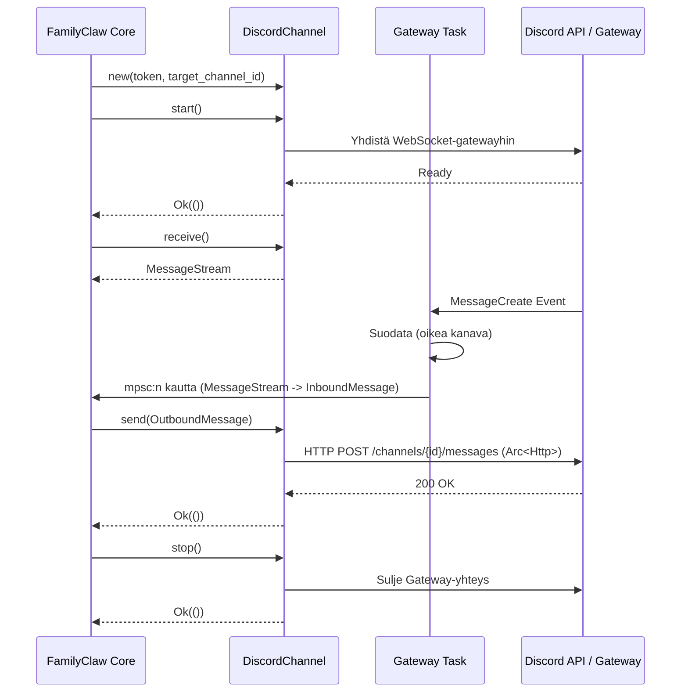

# Arkkitehtuuri: Channels (Kanava-abstraktio)

FamilyClaw käyttää yhtenäistä kanava-abstraktiota yhdistääkseen ydinjärjestelmän eri viestintäalustoihin, kuten Discordiin. Tämän ansiosta järjestelmän sisäinen toiminta on riippumatonta ulkoisista viestintäpalveluista.

## `Channel`-trait ja rajapinta

Kaikki adapterit toteuttavat yhteisen abstraktion, joka määrittelee neljä perusoperaatiota (sopimus):
- `start().await`: Yhdistää alustan palvelimiin (esim. WebSocket-gateway) ja palauttaa valmiustilan tai virheen (`ready`/`virhe`).
- `stop().await`: Sulkee yhteyden siististi.
- `send(OutboundMessage).await`: Lähettää viestin ulkoiselle alustalle.
- `receive()`: Palauttaa `MessageStream`-olion saapuvien viestien kuuntelemiseksi (kutsuttavissa vain kerran).

## Discord-adapterin rakenne

Discord-adapteri on toteutettu `serenity`-kirjaston (versio 0.12) avulla.
- **Gateway-task:** Taustalla pyörivä epäsynkroninen task, joka ylläpitää Discord Gateway -yhteyttä.
- **Vastaanotto (MPSC):** Gateway-task lukee tapahtumat ja välittää saapuvat viestit eteenpäin ytimelle `mpsc` (multi-producer, single-consumer) -kanavan kautta, joka palautetaan `MessageStream`-oliona `receive()`-kutsussa.
- **Lähetys:** `Arc<Http>`-instanssia käytetään epäsynkronisiin API-kutsuihin, jolloin viestien lähetys onnistuu rinnakkain ilman Gateway-taskin estämistä.

## KERROS A -periaate

Channels-abstraktio ja adapterit on suunniteltu noudattamaan ehdotonta **Kerros A** -periaatetta:
Kaikki konfiguraatio (kuten botin tokenit ja kanava-ID:t) annetaan ajonaikaisesti. Koodissa ei saa olla mitään kovakoodattuja arvoja, salaisuuksia tai projektikohtaisia tunnisteita. Tällä varmistetaan, että repoon ei päädy mitään salattavaa.

## Feature-gating (`discord`-lippu)

Discord-adapteri ja sen riippuvuudet on eristetty `discord`-featuren taakse.
**Miksi?** Tämä eristys vähentää käännösaikaa ja binäärin kokoa niille käyttäjille, jotka eivät tarvitse Discord-tukea, sekä mahdollistaa muiden adapterien rinnakkaisen kehittämisen ja kääntämisen itsenäisesti.

## Viestin kulku (Sekvenssikaavio)

