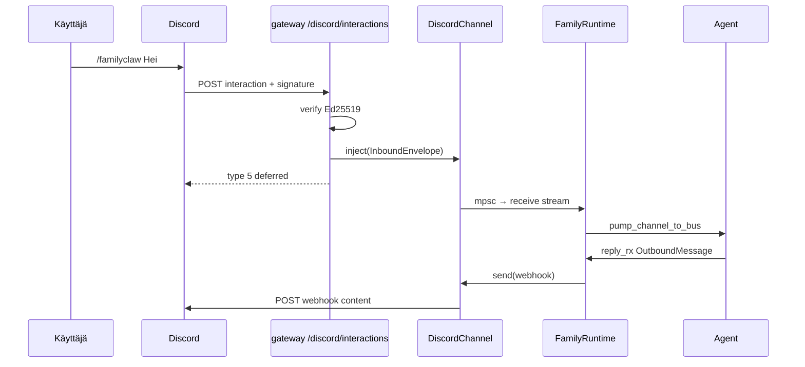

# Discord inbound MVP — rajapintasuunnitelma

> **Päivä:** 2026-06-11  
> **Tila:** Suunnitelma (docs only, toteutus N4)  
> **Lähteet:** `crates/familyclaw-channels/src/discord.rs`, `crates/familyclaw-gateway/src/main.rs`, `crates/familyclaw-runtime/src/lib.rs`, `crates/familyclaw-channels/src/telegram.rs`  
> **Toteuttaja:** Nemotron (N4), arkkitehtuuri DeepSeek (D6)

---

## 1. Nykytila

### 1.1 `DiscordChannel` (vain lähtevä)

`DiscordChannel` toteuttaa [`Channel`]-rajapinnan **yksisuuntaisesti**:

| Operaatio | Toteutus |
|-----------|----------|
| `send()` | HTTP `POST` Discord **incoming webhook** -URL:iin (`content` + `username` = `OutboundMessage.target`) |
| `receive()` | `tokio::sync::mpsc` -virtauksen avaus; viestit tulevat vain `inject()`:n kautta |
| `inject()` | Työntää valmiin [`InboundEnvelope`]:n virtaan (sama malli kuin [`MockChannel`]) |

Webhook on **kanakohtainen**: lähetys menee aina siihen kanavaan, johon webhook on luotu. `OutboundMessage.target` tulkitaan tällä hetkellä webhookin **näyttönimeksi**, ei kanava-id:ksi.

### 1.2 Gateway (`familyclaw-gateway`)

Gateway tarjoaa ohuet HTTP-reitit ja kokoaa [`FamilyRuntime`]:n:

```text
POST /inject  →  inject_discord()  →  DiscordChannel::inject()
                                      →  InboundEnvelope
                                      →  Channel::receive() (runtime)
                                      →  pump_channel_to_bus
                                      →  Resonance Bus → Agent
```

Nykyinen `/inject` on **autentikoimaton** kehitysreitti: JSON `{"sender", "chat_id", "body"}` → [`InboundMessage::into_envelope(ChannelKind::Discord, channel_id)`].

Vertailukohta: [`TelegramChannel`] käynnistää `receive()`-kutsussa taustatehtävän, joka pollaa `getUpdates` long-pollilla ja työntää viestit automaattisesti virtaan. Discordissa vastaava automaatio puuttuu.

### 1.3 MVP-rajoite (runtime)

[`build_family`] käyttää **staattista** `reply_target`-arvoa (`FAMILYCLAW_REPLY_TARGET` / TOML). Tämä riittää yhdelle kanavalle ja yhdelle keskustelulle; per-viesti-alkuperä (`MessageOrigin`) on tulevaisuuden työ.

---

## 2. Tavoite

Lisätä Discordille **oikea saapuva liikenne** ilman `serenity`-riippuvuutta, säilyttäen:

1. [`Channel`]-traitin sopimus (`send` / `receive` / `channel_id` / `kind`)
2. [`InboundEnvelope`]-kanonisointi (`sender`, `conversation`, `channel_id`, `kind`)
3. Olemassa oleva inject-polku (`inject` → mpsc → `pump_channel_to_bus`)
4. KERROS A: ei kovakoodattuja tokeneita, avaimia tai perhepolkuja

**MVP-käyttötapaus:** käyttäjä lähettää viestin Discordissa slash-komennolla (tai vastaa botille interaktiona); agentti vastaa samaan kanavaan webhookin kautta.

---

## 3. Vaihtoehdot

| Vaihtoehto | Inbound-mekanismi | Riippuvuudet | Sopii MVP:hen |
|------------|-------------------|--------------|---------------|
| **A — Interactions HTTP** | Discord POSTaa interaktiot gatewayn URL:iin; Ed25519-allekirjoitus | `ed25519-dalek` tai kevyt verify-helper | **Kyllä — suositus** |
| **B — Gateway WebSocket** | `MESSAGE_CREATE` -tapahtumat shard-yhteydellä | `tokio-tungstenite`, heartbeat, resume | Ei MVP (Phase 2) |
| **C — Ulkoinen silta → `/inject`** | Zapier/n8n/oma skripti kutsuu gatewayta | Ei uutta koodia kanavakerrokseen | Dev/POC; ei tuotanto-MVP |
| **D — Serenity / twilight** | Täysi bot-SDK | Raskas dependency-puu | Hylätty (nykyinen linja) |

**Huom:** Discordilla ei ole “gateway webhook receiver” -mallia tavallisille kanavaviestille — vain **Interactions Endpoint** (HTTP) tai **Gateway** (WebSocket). Tässä suunnitelmassa “webhook receiver” tarkoittaa interactions-endpointia, joka Discord-dokumentaatiossa on HTTP POST -vastaanotin sovelluksen URL:iin.

### Suositus: vaihtoehto A (Interactions)

- Sama filosofia kuin webhook-lähetys: **HTTP + reqwest**, ei pitkäikäistä WebSocket-yhteyttä gateway-prosessissa.
- Discord vaatii julkisen HTTPS-URL:n (kehityksessä ngrok / Cloudflare Tunnel).
- Slash-komento `/familyclaw <viesti>` (tai lyhennetty `/fc`) riittää ensimmäiseen integraatioon.

Phase 2: Gateway WebSocket kanavaviestien kuunteluun (`@mention`, tavalliset viestit ilman slashia).

---

## 4. Arkkitehtuuri (MVP)

```text
┌─────────────────┐     POST /discord/interactions      ┌──────────────────────┐
│  Discord API    │ ──────────────────────────────────► │  familyclaw-gateway  │
│  (Interactions) │     X-Signature-Ed25519 + body      │  axum handler        │
└─────────────────┘                                     └──────────┬───────────┘
                                                                   │ verify + parse
                                                                   ▼
                                                        ┌──────────────────────┐
                                                        │  DiscordChannel      │
                                                        │  inject(envelope)    │
                                                        └──────────┬───────────┘
                                                                   │ mpsc
                                                                   ▼
                        ┌──────────────────────────────────────────────────────┐
                        │  FamilyRuntime (jo käynnissä)                        │
                        │  receive() → pump_channel_to_bus → Bus → Agent         │
                        │  reply_rx → Channel::send() → webhook POST             │
                        └──────────────────────────────────────────────────────┘
```

**Kriittinen invariantti** (sama kuin Telegram):

| Kenttä | Discord-lähde (interaction) | Käyttö |
|--------|----------------------------|--------|
| `channel_id` | FamilyClaw-instanssin tunniste (`discord-main`) | Reititys busissa |
| `sender` | `member.user.id` tai `user.id` | Lähettäjän tunniste |
| `conversation` | `channel_id` (tai `channel_id:thread_id` jos thread) | Vastausosoite (tuleva `reply()` / staattinen `reply_target`) |
| `body` | Slash-option `message` tai `content` | Agentin syöte |

---

## 5. Axum-reitit (`familyclaw-gateway`)

### 5.1 Uudet ja olemassa olevat polut

| Metodi | Polku | Tarkoitus | Kun aktiivinen |
|--------|-------|-----------|----------------|
| `GET` | `/healthz` | Elinvoima | Aina |
| `GET` | `/readyz` | Bus käynnissä | Aina |
| `POST` | `/discord/interactions` | Discord Interactions Endpoint | `channel.kind == discord` + `DISCORD_PUBLIC_KEY` asetettu |
| `POST` | `/inject` | Manuaalinen injektio (dev/test) | `discord_channel` konfiguroitu |

### 5.2 `POST /discord/interactions`

**Pyyntö (Discord → gateway):**

- Headerit: `X-Signature-Ed25519`, `X-Signature-Timestamp`
- Body: raaka JSON (allekirjoituksen tarkistukseen tarvitaan tavuton body)

**Käsittelyjärjestys:**

1. Lue raakabody (`Bytes`).
2. Tarkista Ed25519-allekirjoitus (`public_key` + `timestamp + body`).
3. Deserialisoi `Interaction`-payload.
4. `type == 1` (PING) → vastaa heti `{"type": 1}` (Discord vaatii < 3 s).
5. `type == 2` (APPLICATION_COMMAND):
   - Poimi slash-option (esim. `message`).
   - Rakenna `InboundMessage::new(sender, conversation, body)`.
   - `into_envelope(ChannelKind::Discord, ch.channel_id())`.
   - `DiscordChannel::inject(envelope)`.
   - Vastaa Discordille (ks. §7 — synkroninen vs. deferred).

**Virhekoodit:**

| Tilanne | HTTP | Discord-vastaus |
|---------|------|-----------------|
| Allekirjoitus epävalidi | `401 Unauthorized` | Ei interaction-vastausta |
| Väärä interaction-tyyppi | `400 Bad Request` | Valinnainen virheviesti |
| Tyhjä viesti | `400` | `type: 4`, ephemeral error |
| `inject` epäonnistui | `500` | `type: 4`, ephemeral error |
| Onnistunut (deferred) | `200` | `type: 5` deferred |

### 5.3 `POST /inject` (parannettu, ei poisteta)

Säilytetään taaksepäinyhteensopivuus ja integraatiotestit. MVP:ssä lisätään **valinnainen** Bearer-token:

```http
Authorization: Bearer <FAMILYCLAW_INJECT_TOKEN>
```

Jos env on asetettu ja header puuttuu/väärä → `401`. Jos env puuttuu → nykyinen käytös (varoitus lokissa, vain loopback-suositus).

---

## 6. Autentikointi ja turvallisuus

### 6.1 Discord Interactions (pakollinen tuotannossa)

| Asetus | Lähde | Kuvaus |
|--------|-------|--------|
| `DISCORD_PUBLIC_KEY` | Discord Developer Portal → Application → General | 32-tavun hex; Ed25519 verify |
| `DISCORD_APPLICATION_ID` | Sama portaali | Slash-komennon rekisteröinti (CI/deploy-skripti, ei runtime pakollinen verifyyn) |

Verify-algoritmi (Discord-dokumentaatio):

```text
message = timestamp_bytes || raw_body
verify(public_key, message, signature)
```

Toteutus: uusi moduuli `familyclaw-gateway/src/discord_verify.rs` tai `familyclaw-channels/src/discord/interactions.rs` (verify + parse). Ei logata raakabodya sisältäen PII:tä debug-tasolla tuotannossa.

### 6.2 Inject-reitti (valinnainen)

| Asetus | Kuvaus |
|--------|--------|
| `FAMILYCLAW_INJECT_TOKEN` | Jaettu salaisuus; `Authorization: Bearer` |

### 6.3 Verkko

- Oletus `127.0.0.1:8787` — interactions **ei toimi** ilman julkista HTTPS-reverse-proxya.
- Dokumentoi: ngrok / Caddy / Cloudflare Tunnel → `https://<host>/discord/interactions`.
- Discord Developer Portal: Interactions Endpoint URL.

### 6.4 KERROS A / B

- Avaimet vain env / TOML (`[channel.discord]` laajennus), ei repoon.
- `doctor`-komento: raportoi `DISCORD_PUBLIC_KEY` set/MISSING (ei arvoa).

---

## 7. Discord-vastaus vs. agentin ajoaika

Agentin ajattelu voi ylittää Discordin **3 sekunnin** interaction-ikkunan.

**MVP-strategia (kaksivaiheinen):**

1. Handler vastaa heti `type: 5` (`DEFERRED_CHANNEL_MESSAGE_WITH_SOURCE`).
2. Agentin vastaus tulee `reply_rx` → `Channel::send()` → webhook (nykyinen polku).

**Rajoitus:** deferred + webhook -yhdistelmä **ei** käytä interaction follow-up -URL:ia; vastaus näkyy webhook-kanavalla, ei välttämättä “vastauksena” slash-komennolle. Tämä on hyväksyttävä MVP:ssä yhden kanavan asennuksessa.

**Phase 2 (valinnainen):** tallenna `interaction_token` + `application_id` envelope-metadataan; follow-up `PATCH /webhooks/{app_id}/{token}/messages/@original` bot-tokenilla.

---

## 8. Konfiguraatio

### 8.1 Uudet env-muuttujat

| Muuttuja | Pakollinen (discord inbound) | Kuvaus |
|----------|------------------------------|--------|
| `DISCORD_WEBHOOK_URL` | Kyllä (lähtevä) | Jo olemassa |
| `DISCORD_CHANNEL_ID` | Kyllä | Instanssin tunniste (ei Discord snowflake) |
| `DISCORD_PUBLIC_KEY` | Kyllä (interactions) | Ed25519 public key hex |
| `FAMILYCLAW_REPLY_TARGET` | Kyllä | Staattinen reply (MVP) |
| `DISCORD_APPLICATION_ID` | Suositeltu | Slash register / follow-up |
| `DISCORD_BOT_TOKEN` | Phase 2 | Follow-up / Gateway |
| `FAMILYCLAW_INJECT_TOKEN` | Ei | Suojaa `/inject` |

### 8.2 TOML-laajennus (`FamilyConfig`)

```toml
[channel.discord]
webhook_url = ""          # tai DISCORD_WEBHOOK_URL env
channel_id = "discord-main"
public_key = ""           # DISCORD_PUBLIC_KEY env override
application_id = ""       # valinnainen
```

`apply_env()` ylikirjoittaa kuten muutkin kentät.

### 8.3 Slash-komennon rekisteröinti (deploy, ei runtime)

Erillinen CLI-komento tai dokumentoitu `curl` Discord API:in:

```text
POST /applications/{app_id}/commands
Authorization: Bot <token>
{ "name": "familyclaw", "description": "...", "options": [{ "name": "message", "type": 3, "required": true }] }
```

Tämä voi odottaa N4:n jälkeen; suunnitelma dokumentoi komennon nimen ja option rakenteen.

---

## 9. Muutokset moduuleittain (toteutusohje N4)

### 9.1 `familyclaw-channels` — `discord.rs`

| Muutos | Kuvaus |
|--------|--------|
| `DiscordInteraction::from_payload(...)` | Parsii interaction JSON → `InboundMessage` |
| `verify_signature(...)` | Ed25519 (tai delegoi gatewaylle) |
| Säilytä `inject()` | Interactions-handler kutsuu sitä; ei muuta `receive()`-sopimusta |
| Testit | Fixture JSON → envelope-kentät; mock verify |

**Ei** muuteta `send_to_webhook`-logiikkaa MVP:ssä.

### 9.2 `familyclaw-gateway` — `main.rs`

| Muutos | Kuvaus |
|--------|--------|
| `build_router()` | `.route("/discord/interactions", post(handle_discord_interaction))` |
| `GatewayState` | Säilytä `discord_channel: Option<Arc<DiscordChannel>>` |
| `inject_discord` | Bearer-tarkistus jos token asetettu |
| `doctor` | Lisää `DISCORD_PUBLIC_KEY` tarkistus |

### 9.3 `familyclaw-runtime`

Ei muutoksia MVP:ssä — inject riittää, koska `pump_channel_to_bus` on jo käynnissä.

---

## 10. Sekvenssikaavio (slash-komento)



---

## 11. Testaus

| Taso | Mitä |
|------|------|
| Yksikkö | Signature verify (tunnettu testivektori); interaction → `InboundMessage` |
| Integraatio | `DiscordChannel::inject` + mock stream (jo olemassa mock-mallilla) |
| Gateway | axum `TestClient`: PING → 200; invalid sig → 401; inject + bearer |
| E2E (manuaalinen) | ngrok + oikea Discord-sovellus; slash → webhook-vastaus kanavalla |

---

## 12. Rajauksen ulkopuolella (ei MVP)

| Kohde | Syy |
|-------|-----|
| Gateway WebSocket (`MESSAGE_CREATE`, `@mention`) | Vaatii shard-hallinnan; Phase 2 |
| Serenity / twilight | Rikkoo kevyen HTTP-linjan |
| Monikanava / moni keskustelu | Vaatii `MessageOrigin`; runtime-rajoite |
| Webhook → oikea `target`-kanava | Nykyinen webhook on yhden kanavan |
| Interaction follow-up URL | Deferred + webhook riittää MVP:hen |
| Nappulat, modaalit, autocomplete | Lisäinteraction-tyypit |
| Tiedostoliitteet, embedit, slash-alakomennot | Sisältömallin laajennus |
| Sharding, useat gateway-instanssit | Skaalaus |
| Rate limit -jonot Discord API:lle | Yksinkertainen retry riittää myöhemmin |
| Poista `/inject` | Säilytetään dev-reittinä tokenilla |

---

## 13. Toteutusvaiheet (N4)

1. **Verify + parse** — `familyclaw-channels` tai gateway-moduuli, testit.
2. **Axum handler** — `/discord/interactions`, PING + APPLICATION_COMMAND.
3. **Konfig** — `DISCORD_PUBLIC_KEY`, TOML, `doctor`.
4. **Inject-auth** — valinnainen `FAMILYCLAW_INJECT_TOKEN`.
5. **Dokumentaatio** — `QUICKSTART.md`: ngrok, slash register, env-lista.
6. **Manuaalinen E2E** — yksi Discord-palvelin, yksi webhook, yksi slash.

**Valmis kun:** slash-komennolla lähetetty viesti kulkee `inject` → agentti → webhook-vastaus ilman manuaalista `curl /inject` -kutsua.

---

## 14. Avoimet kysymykset

1. **Slash-nimi:** `/familyclaw` vs `/fc` — tuotannossa yksi, toinen alias Phase 2.
2. **Thread-tuki:** `conversation = "{channel_id}:{thread_id}"` — tarvitaanko heti?
3. **Vastauksen muoto:** pelkkä `content` vai embed agentin nimellä?
4. **Reply_target vs. conversation:** päivitetäänkö runtime käyttämään envelope `conversation` webhook-lähetyksessä (vaatii webhookin kanavan = conversation)?

---

## 15. Viitteet

- [Discord Interactions — Receiving an interaction](https://discord.com/developers/docs/interactions/receiving-and-responding)
- [Ed25519 signature verification](https://discord.com/developers/docs/interactions/receiving-and-responding#security-and-authorization)
- FamilyClaw: `docs/LAYER_BOUNDARY.md` (kanavakerros reunaan)
- Rinnakkaissuunnitelma: `docs/plans/2026-06-11-parallel-agent-build-plan.md` (D6 / N4)
