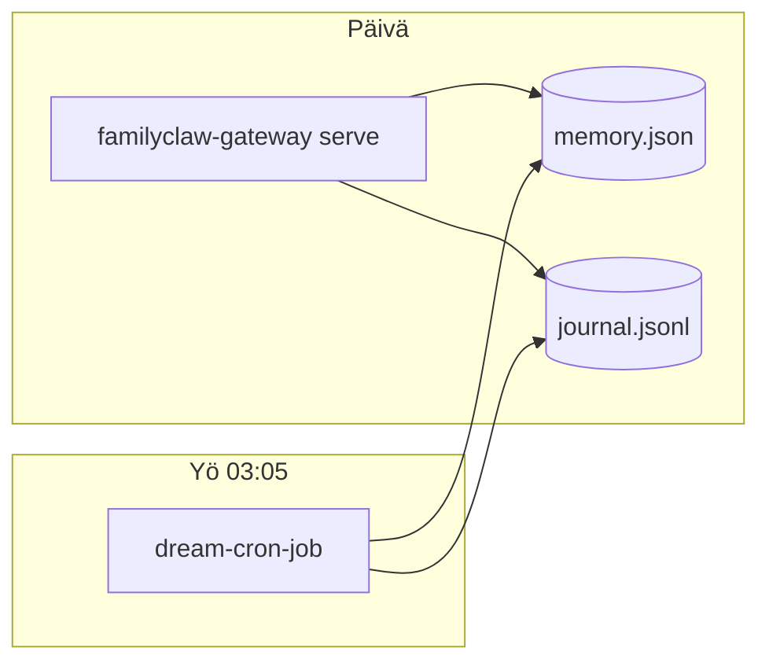

# DreamCycle — yöllinen ajo (cron / Task Scheduler / systemd)

> **Päivä:** 2026-06-11  
> **Tila:** Suunnitelma (MVP, vain dokumentaatio — ei Rust-muutoksia tässä vaiheessa)  
> **Lähteet:** `crates/familyclaw-dream`, `crates/familyclaw-gateway`, `crates/familyclaw-runtime`, `docs/RUNBOOK_WINDOWS.md`  
> **Toteutus:** Nemotron (koodi myöhemmin), DeepSeek 4 Pro (tämä suunnitelma)

---

## 1. Tausta ja nykytila

### Mitä `familyclaw-dream` tekee

Yöllinen `DreamCycle` konsolidoi muistin viidessä vaiheessa (`merge_duplicates` → `drop_contradicted` → `absolutize_dates` → `consolidate` → `DreamReport`). Se lukee:

- muistit: [`LocalJsonStore`](../../crates/familyclaw-memory) (`memory.json`),
- ristiriidat: durable-journal [`journal.jsonl`](../../crates/familyclaw-durable).

[`DesireClock`](../../crates/familyclaw-dream/src/desire_clock.rs) määrittää **suunnitellun** uniajan: oletus **klo 03:00** (tällä hetkellä **UTC**, ei paikallista aikavyöhykettä — katso §8).

### Mitä gateway tekee tänään

`familyclaw-gateway` on pitkäikäinen prosessi (`serve` / `status` / `doctor`). Se kutsuu [`build_family`](../../crates/familyclaw-runtime/src/lib.rs), joka:

1. avaa `FAMILYCLAW_DATA_DIR` → `journal.jsonl` + `memory.json`,
2. käynnistää **sisäisen** unisilmukan: `tokio::spawn` + `sleep(FAMILYCLAW_DREAM_INTERVAL_SECS)` (oletus **6 h**), sitten `DreamCycle::run`.

Gatewaylla **ei ole** erillistä `dream`-alikomentoa. Unijakso on sidottu gateway-prosessiin, ei kalenteriaikaan.

### Mitä `dream-cron-job` tekee tänään

Erillinen binääri [`dream-cron-job`](../../crates/familyclaw-dream/src/bin/dream-cron-job.rs):

- käyttää **placeholder**-tallennusta (`InMemoryJournal`, mock-raportti),
- tarkoitus: OS-ajastimen entrypoint (`DesireClock` + `has_run_step("dream_cycle")`),
- **ei vielä tuotantovalmis**.

### MVP-tavoite

Yksi deterministinen yöajo per kalenteripäivä, **sama data-hakemisto** kuin gatewaylla, idempotentti uudelleenajolle, selkeä erottelu gatewayn sisäisestä silmukasta.

---

## 2. Arkkitehtuuripäätös (MVP)

| Vaihtoehto | Kuvaus | MVP-suositus |
|------------|--------|--------------|
| **A — Standalone `dream-cron-job`** | OS-ajastin kutsuu erillistä binääriä kerran yössä | **Kyllä — tuotanto** |
| **B — `familyclaw-gateway dream run`** | Sama logiikka gateway-binäärin alikomentona | **Myöhemmin** (yksi asennettava exe Windowsille) |
| **C — Erillinen `dream_daemon`** | Pitkäikäinen prosessi, oma ajastin | **Ei MVP** — päällekkäinen gatewayn kanssa |
| **D — Vain runtime-silmukka** | `FAMILYCLAW_DREAM_INTERVAL_SECS` gatewayssä | **Vain kehitys** — ei 03:00-kalenteria |

**Valinta:** **A** tuotannossa. Gateway pyörii päivällä/viestien aikana; yöllinen konsolidaatio ajetaan **erillisellä, lyhytaikaisella** prosessilla samaan `FAMILYCLAW_DATA_DIR`:ään.

**Perustelu:**

- `DesireClock` on suunniteltu **kerran yössä** -mallille, ei 6 h välein.
- Windows-kone voi olla pois päältä klo 03:00 → OS-ajastimen *missed run* / käynnistyksen jälkeinen catch-up on luonnollinen.
- Gatewayn sisäinen silmukka jää **pois päältä** tuotannossa (§5), jotta unijaksoa ei ajeta kahdesti.



---

## 3. Suositeltu ajankohta

| Parametri | Arvo | Huomio |
|-----------|------|--------|
| **Kalenteriaika** | **03:05 paikallista** | 5 min buffer herätykseen / levyyn; DesireClock-koodi käyttää 03:00 UTC (väliaika) |
| **Tiheys** | Kerran / vuorokausi | Ei päiväajoa |
| **Catch-up** | Kyllä | Jos kone/palvelin oli pois päältä → aja heti kun ajastin herää (Windows: *Run task as soon as possible after a scheduled start is missed*) |
| **Hetzner (UTC)** | `03:05 UTC` tai `01:05 UTC` (EET talvi) | Valitse **yksi** TZ ja pidä `TZ` env vakiona palvelulla |

**Miksi ei tasan 03:00:** lyhyt viive vähentää törmäystä mahdollisen gateway-uudelleenkäynnistyksen ja levyn I/O:n kanssa.

---

## 4. Ympäristömuuttujat

### Pakolliset (MVP JSON-polku)

| Muuttuja | Esimerkki | Käyttö |
|----------|-----------|--------|
| `FAMILYCLAW_DATA_DIR` | `E:\familyclaw-data` / `/var/lib/familyclaw` | `memory.json` + `journal.jsonl` (sama kuin gateway) |
| `FAMILYCLAW_AGENT_NAME` | `agent_alpha` | Lokit / tuleva askelnimi-prefix |

### Suositellut

| Muuttuja | Esimerkki | Käyttö |
|----------|-----------|--------|
| `FAMILYCLAW_PROFILE_DIR` | `E:\familyclaw-profiles` | Yhtenäisyys gatewayn kanssa (uni ei lue SOUL:ia MVP:ssä) |
| `RUST_LOG` | `info,familyclaw::dream=debug` | Raportointi |
| `TZ` | `Europe/Helsinki` / `UTC` | Ajastimen ja lokien selkeys (palvelimella eksplisiittinen) |

### Unikonfiguraatio (tuleva / osittain jo koodissa)

| Muuttuja | Oletus | Käyttö |
|----------|--------|--------|
| `FAMILYCLAW_DREAM_INTERVAL_SECS` | `21600` (6 h) | **Vain gateway-runtime-silmukka** — tuotannossa aseta `0` poistoon *tai* erittäin suuri arvo kunnes `FAMILYCLAW_DREAM_MODE=external` on toteutettu (§8) |
| `FAMILYCLAW_DREAM_MERGE_SIMILARITY` | `0.85` | `DreamConfig` (tuleva env-silta) |
| `FAMILYCLAW_DREAM_DISABLED` | — | `1` = älä käynnistä runtime-silmukkaa gatewayssä (tuleva) |

### Ei tarvita uniajossa

Telegram-tokenit, `FAMILYCLAW_PROVIDERS`, gateway-osoite — unijakso ei kutsu LLM:ää.

---

## 5. Gateway vs standalone — käyttösäännöt

### Tuotanto (suositus)

1. Gateway: `familyclaw-gateway serve` (palvelu / Task Scheduler *At startup* / systemd `familyclaw-gateway.service`).
2. Uni: `dream-cron-job` kerran yössä (erillinen ajastin).
3. **Poista päällekkäisyys:** aseta `FAMILYCLAW_DREAM_INTERVAL_SECS=999999999` gateway-ympäristöön *tai* odota §8 `FAMILYCLAW_DREAM_DISABLED=1`.

### Konkurrenssi samaan dataan

- `memory.json`: [`LocalJsonStore`](../../crates/familyclaw-memory/src/store.rs) käyttää `<path>.lock` — toinen prosessi **odottaa** tai epäonnistuu selkeästi.
- `journal.jsonl`: sama prosessi kerrallaan on turvallisin MVP:ssä.

**MVP-sääntö:** aja unijakso **matalan liikenteen aikaan** (03:05). Vältä rinnakkaista gatewayn raskasta vuoroa ja uniajoa. Jos lock epäonnistuu → exit ≠ 0, yritä uudelleen 15 min myöhemmin (ajastin / `OnFailure`).

### Kehitys

- Ilman ajastinta: `FAMILYCLAW_DREAM_INTERVAL_SECS=300` + gateway riittää demoihin.
- Manuaalinen testi (tänään): `cargo run -p familyclaw-dream --bin dream-cron-job` (kun binääri on kytketty oikeaan storeen).

---

## 6. Windows — Task Scheduler

### Binääri

```powershell
cd E:\Familyclaw
cargo build --release -p familyclaw-dream --bin dream-cron-job --locked
# → target\release\dream-cron-job.exe
```

Vaihtoehto tulevaisuudessa: `familyclaw-gateway.exe dream run` (sama logiikka, yksi exe).

### Ympäristö

Tallenna Layer B -tiedostoon (ei repoon), esim. `E:\familyclaw-profiles\dream-cron.env.ps1`:

```powershell
$env:FAMILYCLAW_DATA_DIR    = "E:\familyclaw-data"
$env:FAMILYCLAW_PROFILE_DIR = "E:\familyclaw-profiles"
$env:FAMILYCLAW_AGENT_NAME  = "agent_alpha"
$env:RUST_LOG               = "info,familyclaw::dream=info"
```

### Käynnistysskripti

`E:\familyclaw-profiles\run-dream-cycle.ps1`:

```powershell
Set-StrictMode -Version Latest
$ErrorActionPreference = "Stop"
. "E:\familyclaw-profiles\dream-cron.env.ps1"
$bin = "E:\Familyclaw\target\release\dream-cron-job.exe"
$logDir = "E:\familyclaw-data\logs"
New-Item -ItemType Directory -Force -Path $logDir | Out-Null
$stamp = Get-Date -Format "yyyy-MM-dd"
& $bin 2>&1 | Tee-Object -FilePath "$logDir\dream-$stamp.log"
exit $LASTEXITCODE
```

### Task Scheduler -asetukset (GUI tai `schtasks`)

| Kenttä | Arvo |
|--------|------|
| Nimi | `FamilyClaw-DreamCycle` |
| Trigger | Päivittäin **03:05** |
| Missed runs | **Run task as soon as possible after scheduled start is missed** |
| Action | `powershell.exe -NoProfile -ExecutionPolicy Bypass -File E:\familyclaw-profiles\run-dream-cycle.ps1` |
| Käyttäjä | Sama kuin gateway (kirjautunut käyttäjä tai palvelutili) |
| Wake | *Wake the computer to run this task* (valinnainen kannettavalla) |
| Rinnakkaisuus | **Do not start a new instance** (yksi uni kerrallaan) |

Esimerkki `schtasks` (tarkista polut):

```powershell
schtasks /Create /TN "FamilyClaw-DreamCycle" /SC DAILY /ST 03:05 `
  /TR "powershell.exe -NoProfile -ExecutionPolicy Bypass -File E:\familyclaw-profiles\run-dream-cycle.ps1" `
  /F
```

### Gateway erikseen

Katso [`RUNBOOK_WINDOWS.md`](../RUNBOOK_WINDOWS.md): gateway oma tehtävä / manuaalinen `serve`. Uni-tehtävä **ei** korvaa gatewayta.

---

## 7. Linux / Hetzner — systemd timer

### Binääri

```bash
cargo build --release -p familyclaw-dream --bin dream-cron-job --locked
install -m 755 target/release/dream-cron-job /usr/local/bin/familyclaw-dream-cron
```

### Ympäristö

`/etc/familyclaw/dream.env` (mode `600`, root tai `familyclaw`-käyttäjä):

```bash
FAMILYCLAW_DATA_DIR=/var/lib/familyclaw
FAMILYCLAW_AGENT_NAME=agent_alpha
FAMILYCLAW_PROFILE_DIR=/opt/familyclaw/profiles
RUST_LOG=info,familyclaw::dream=info
TZ=UTC
```

### `familyclaw-dream.service` (oneshot)

```ini
[Unit]
Description=FamilyClaw nightly DreamCycle
After=network-online.target
Wants=network-online.target
ConditionPathExists=/var/lib/familyclaw

[Service]
Type=oneshot
User=familyclaw
Group=familyclaw
EnvironmentFile=/etc/familyclaw/dream.env
ExecStart=/usr/local/bin/familyclaw-dream-cron
StandardOutput=journal
StandardError=journal
# Älä limittää gatewayn kanssa: uni on lyhyt
TimeoutStartSec=600

[Install]
WantedBy=multi-user.target
```

### `familyclaw-dream.timer`

```ini
[Unit]
Description=Run FamilyClaw DreamCycle daily at 03:05

[Timer]
OnCalendar=*-*-* 03:05:00
Persistent=true
Unit=familyclaw-dream.service

[Install]
WantedBy=timers.target
```

```bash
sudo systemctl daemon-reload
sudo systemctl enable --now familyclaw-dream.timer
systemctl list-timers familyclaw-dream.timer
```

### Gateway-palvelu (erillinen)

`familyclaw-gateway.service` pitää olla erillinen yksikkö. Lisää gateway-yksikköön tuotannossa:

```ini
Environment=FAMILYCLAW_DREAM_INTERVAL_SECS=999999999
```

(tai tuleva `FAMILYCLAW_DREAM_DISABLED=1`).

---

## 8. Virheenkäsyntö ja idempotenssi

### Odotettu käyttäytyminen (tavoite kun binääri on valmis)

| Tilanne | Toimenpide | Exit |
|---------|------------|------|
| Uni jo ajettu tälle yölle (`has_run_step("dream_cycle")`) | Lokita "skipped", **onnistuminen** | 0 |
| `DreamCycle::run` onnistuu | Kirjaa `DreamReport` durable-askeleeseen | 0 |
| Lock `memory.json` | Odota / fail → uudelleenyrittö | ≠ 0 |
| Journal/store puuttuu | Fail fast, älä luo tyhjää tuhoa | ≠ 0 |
| Osittainen kaatuminen kesken `step` | Replay seuraavalla kerralla (`DurableContext`) | 0 tai ≠ 0 riippuu korjauksesta |

### Nykyiset aukot (tiedostettu)

1. **`dream-cron-job` mockaa** — ei muuta levyä; tuotantoon kytkentä `FileJournal` + `LocalJsonStore::open`.
2. **`has_run_step("dream_cycle")`** ei erottele **päivämääriä** — yksi askel ikuisesti. Tavoite: askelnimi `dream_cycle:2026-06-11` tai marker-rivi journaliin.
3. **`DesireClock` käyttää UTC:tä** — Task Scheduler 03:05 *paikallista* ≠ koodi 03:00 UTC. Korjaus: `chrono-tz` + `FAMILYCLAW_TZ` tai dokumentoi UTC-ajastin Hetznerillä.
4. **Gatewayn runtime-silmukka** voi ajaa unen samaan aikaan — poista käytöstä §5.

### Lokitus ja hälytys (MVP)

- Windows: `E:\familyclaw-data\logs\dream-YYYY-MM-DD.log`
- Linux: `journalctl -u familyclaw-dream.service`
- Hälytys: exit ≠ 0 → Task Scheduler *Last Run Result* / systemd `OnFailure=` (myöhemmin webhook)

### Uudelleenyrittö

| Alusta | MVP |
|--------|-----|
| Windows | Manuaalinen uudelleenajo tai toinen trigger +15 min (valinnainen) |
| systemd | `Restart=on-failure` **ei** oneshotille — käytä `Persistent=true` timeria seuraavana yönä tai erillistä retry-timeria |

---

## 9. Validointi (acceptance)

Suorita ennen tuotantoon vientiä ja ajastimen käyttöönoton jälkeen.

### 9.1 Ennen ajastinta (kehittäjä)

```powershell
cd E:\Familyclaw
cargo test -p familyclaw-dream
cargo test -p familyclaw-bench dream_quality
cargo run -p familyclaw-bench --bin bench -- s3
```

Odotus: **s3_dream_quality PASS** ([`docs/SCORECARD.md`](../SCORECARD.md)).

### 9.2 Data-polku

```powershell
# Gateway sammutettuna tai idle
$env:FAMILYCLAW_DATA_DIR = "E:\familyclaw-data"
Test-Path E:\familyclaw-data\memory.json
Test-Path E:\familyclaw-data\journal.jsonl
```

### 9.3 Kuiva ajo (kun binääri on kytketty)

```powershell
. E:\familyclaw-profiles\dream-cron.env.ps1
E:\Familyclaw\target\release\dream-cron-job.exe
echo $LASTEXITCODE   # 0
```

Toinen ajo peräkkäin → **skipped** (idempotentti), exit 0.

### 9.4 Ajastimen smoke

1. Aseta testitrigger +2 min.
2. Varmista loki syntyy.
3. Tarkista `memory.json` muokkausaika / dream-rivi journalissa (kun toteutus valmis).
4. Käynnistä gateway → Telegram-viesti näkee konsolidoidun muistin.

### 9.5 Gateway ei kaksoisaja

```powershell
# Gateway käynnissä, FAMILYCLAW_DREAM_INTERVAL_SECS=999999999
# Odota > 6 h → ei familyclaw::dream-lokia gatewaystä
```

### 9.6 Bench-regressio (CI)

```powershell
cargo fmt --all -- --check
cargo clippy --workspace --all-targets -- -D warnings -A clippy::doc_markdown -A clippy::too_many_lines
cargo test --workspace
cargo run -p familyclaw-bench --bin bench -- all
```

---

## 10. Toteutusjärjestys (Rust, myöhempi PR)

Minimaalinen koodityölista — **ei osa tätä dokumenttia commitia**:

1. **`dream-cron-job`**: `FAMILYCLAW_DATA_DIR` → `FileJournal::open` + `LocalJsonStore::open` + oikea `DreamCycle::run` (async `#[tokio::main]`).
2. **Idempotenssi**: päiväkohtainen askelnimi tai `DesireClock::last_dream_time` + journal-marker.
3. **Gateway**: `FAMILYCLAW_DREAM_DISABLED=1` tai `dream run` alikomento.
4. **`DesireClock`**: paikallinen aikavyöhyke (`FAMILYCLAW_TZ`).
5. **Dokumentoi** [`RUNBOOK_WINDOWS.md`](../RUNBOOK_WINDOWS.md) + `docs/hearth-hetzner.md` (timer-esimerkit).

---

## 11. Yhteenveto

| Kohde | MVP-päätös |
|-------|------------|
| Ajastin | OS-taso: Task Scheduler (Windows) / systemd timer (Hetzner) |
| Entrypoint | `dream-cron-job` (myöhemmin valinnainen `gateway dream run`) |
| Aika | **03:05** paikallista / eksplisiittinen `TZ` palvelimella |
| Data | Sama `FAMILYCLAW_DATA_DIR` kuin gateway |
| Gateway | Sisäinen 6 h -silmukka **pois** tuotannossa |
| Validointi | `bench s3` + kaksoisajo + ajastin-smoke |

*Tämä dokumentti on tarkoituksella kapea: yöllinen uni ilman uutta daemonia, ilman LLM-riippuvuuksia, yhteensopiva JSON-MVP-polun kanssa.*
