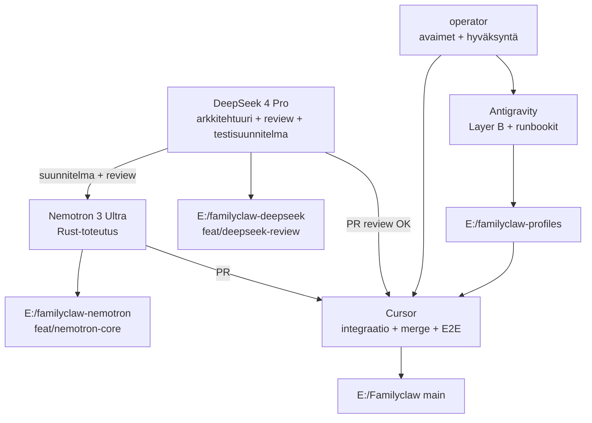
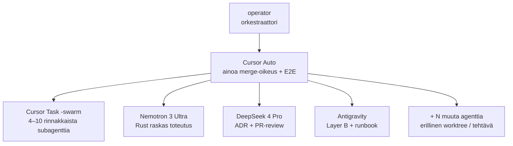

# FamilyClaw — rinnakkaisagenttien rakennussuunnitelma

> **Versio:** 2026-06-11 (ilta)  
> **Kohdeyleisö:** Nemotron 3 Ultra, DeepSeek 4 Pro, Cursor (Auto), Antigravity  
> **Omistaja:** operator — avaimet, SOUL-hyväksyntä, tuotantopalvelin  
> **Nykyvalmius:** ~**55–60 %** → tavoite **~75 % (1 pv)** / **~88 % (2–3 pv)** / **~94 % (1–2 vk)**

---

## 1. Tilannekatsaus

### Mitä on valmiina (Layer A)

| Osa | Tila | Todiste |
|-----|------|---------|
| Durable replay + crash matrix | Valmis | `docs/SCORECARD.md` S1 PASS |
| Eternal Thread + decay | Valmis | S2, S5, S6 PASS |
| DreamCycle | Valmis | S3 PASS |
| Resonance Bus + contagion | Valmis | S4 PASS |
| Gateway + Telegram | Valmis (E2E odottaa I1) | `familyclaw-gateway` |
| Surpass-merge + observability | **Valmis** | commit `87b864d`, `familyclaw-observability`, `comparative.rs` |
| Dual-write resume | **Valmis** | `continuity_daemon.rs` + integraatiotesti |
| WorkExecutor + TurnExecutor | **Valmis** | `familyclaw-bridge` |
| Dream-cron binääri | **Valmis** | `dream-cron-job` + `FAMILYCLAW_DREAM_DISABLED` |
| Discord inbound MVP | **Valmis** | `POST /discord/interactions` + Ed25519 |
| Clippy pedantic clean | Valmis (night-haara) | `feat/night-2026-06-11` |

### Mitä puuttuu (kriittinen)

| Osa | Tila | Polku |
|-----|------|-------|
| Agenttien sielut (SOUL) | Luonnokset ~45 % | `E:/familyclaw-profiles` |
| `.env` avaimet (I1) | Odottaa operator | `E:/familyclaw-profiles/.env` |
| LiveTurnExecutor | Odottaa agent_gamma PR | `docs/handoff/agent_gamma_LIVE_TURN_EXECUTOR.md` |
| E2E Telegram + agent_alpha | Odottaa I1 | C7 |
| OSS-julkaisu | Vaihe 6 avoin | README roadmap |

### Kypsyys nyt

- **Layer A (koodi):** ~**85 %**
- **Layer B (profiilit):** ~**45 %**
- **Tuotantodemo:** ~**35 %**
- **Kokonaisuus:** ~**55–60 %**

---

## 2. Agenttitiimi ja roolit



### Roolitaulukko

| Agentti | Tehtävä | Worktree / polku | Älä koske |
|---------|---------|------------------|-----------|
| **Cursor** | Git merge, CI, konfliktit, E2E-validointi, data-polku | `E:/Familyclaw` (main) | SOUL-sisältö, suora merge ilman reviewta |
| **DeepSeek 4 Pro** | Arkkitehtuuri, dual-write-suunnitelma, testisuunnitelmat, PR-review, CODE_REVIEW | `E:/familyclaw-deepseek` → `feat/deepseek-review` | Merge mainiin, Layer B profiilit |
| **Nemotron 3 Ultra** | Rust-toteutus DeepSeekin hyväksymän suunnitelman mukaan | `E:/familyclaw-nemotron` → `feat/nemotron-core` | Merge mainiin suoraan, SOUL.md |
| **Antigravity** | SOUL.md, runbookit, TOML-esimerkit, docs-polish | `E:/familyclaw-profiles` + `docs/` PR | `crates/` Rust-koodi |
| **operator** | `.env` avaimet, SOUL-hyväksyntä, Hetzner/systemd | — | — |

### Miksi DeepSeek 4 Pro mukaan?

DeepSeek 4 Pro täydentää Nemotronia **review-first -ketjussa**:

1. **Ennen koodia:** dual-write-korjauksen transaktiorajat, failure-matriisi, testilista
2. **Nemotron toteuttaa** test-first -tyylillä
3. **DeepSeek reviewaa** PR:n (sivuvaikutukset, replay-oikeellisuus, Layer B -vuoto)
4. **Cursor mergaa** vain jos DeepSeek + CI OK

Tämä nostaa 1 päivän tavoitetta **~70 % → ~75 %** ja vähentää regressioriskiä merge-konflikteissa.

**DeepSeekin omat tehtävät (ei päällekkäisyyttä Nemotronin kanssa):**

| Tehtävä | Tiedostot / alue |
|---------|------------------|
| Dual-write ADR + toteutussuunnitelma | `docs/plans/2026-06-11-dual-write-adr.md` |
| Dream-cron arkkitehtuurivalinta (Windows vs Linux) | `docs/plans/2026-06-11-dream-cron-design.md` |
| Discord inbound -rajapintasuunnitelma | `docs/plans/2026-06-11-discord-inbound-design.md` |
| `Subject`-rajapinnan laajennus live-kilpailijalle | `crates/familyclaw-bench/src/subject/` (suunnitelma + stub) |
| PR-review checklist Nemotron-haaroille | kommentit PR:ään, ei suoraa mergeä |

---

## 3. Worktree- ja haarasäännöt

### Alustus (Cursor, Aalto 0)

```powershell
cd E:\Familyclaw
git worktree add E:\familyclaw-nemotron -b feat/nemotron-core
git worktree add E:\familyclaw-deepseek -b feat/deepseek-review
# Olemassa olevat:
# E:\familyclaw-surpass      → feat/surpass-build
# E:\familyclaw-wf-301-2-clippy → wf_92ee568f-301-2-clippy
```

### Merge-järjestys (pakollinen)

```
✅ 1. wf_301-2-clippy        → night (aiemmin)
✅ 2. feat/surpass-build     → night (87b864d)
⏳ 3. agent_gamma PR (LiveTurnExecutor / amplifier) — kun valmis
⏳ 4. feat/nemotron-core       → main (N3/N4 nyt night-haarassa)
⏳ 5. feat/deepseek-review     → docs/review-kommentit
```

### Konfliktien välttäminen

| Polku | Omistaja |
|-------|----------|
| `crates/familyclaw-agent/**` | Nemotron (toteutus), DeepSeek (review) |
| `crates/familyclaw-durable/**` | Nemotron |
| `crates/familyclaw-gateway/**` | Nemotron (discord), Cursor (merge) |
| `crates/familyclaw-dream/**` | Nemotron |
| `docs/plans/**` | DeepSeek + Antigravity |
| `E:/familyclaw-profiles/**` | Antigravity only — **EI repoon** |
| `E:/familyclaw-data/**` | Cursor only — **yksi prosessi kerrallaan** |

---

## 4. Tehtävälista agenteittain

### Cursor (integraatiopäällikkö)

- [x] **C1** Luo worktreet (`familyclaw-nemotron`, `familyclaw-deepseek`)
- [x] **C2** Merge clippy-haara → main
- [x] **C3** Korjaa `E:/familyclaw-data` LOCK (JSON-MVP + init-skripti)
- [x] **C4** Valitse MVP data-polku: `FAMILYCLAW_DATA_DIR` JSON
- [x] **C5** Merge surpass-haara → main (observability, COMPARISON, SURPASS_DEMO)
- [ ] **C6** Merge nemotron-core (kun DeepSeek review OK + CI green)
- [ ] **C7** E2E: gateway + Telegram + agent_alpha SOUL (odottaa I1 `.env`)
- [x] **C8** Aja benchmark: `cargo run -p familyclaw-bench --bin bench -- all`
- [x] **C9** Päivitä `docs/SCORECARD.md` jos tulokset muuttuvat

### DeepSeek 4 Pro (arkkitehtuuri + review)

- [ ] **D1** Lue `docs/CODE_REVIEW_2026-06-04.md` + `crates/familyclaw-agent/src/` durable-polku
- [ ] **D2** Kirjoita `docs/plans/2026-06-11-dual-write-adr.md` (transaktio, järjestys, rollback)
- [ ] **D3** Kirjoita dual-write testimatriisi (BeforeWrite / MidWrite / MidReplay skenaariot)
- [ ] **D4** Review Nemotronin `feat/nemotron-core` PR ennen mergeä
- [ ] **D5** Kirjoita `docs/plans/2026-06-11-dream-cron-design.md` (Windows Task Scheduler vs tokio-cron)
- [ ] **D6** Kirjoita `docs/plans/2026-06-11-discord-inbound-design.md`
- [ ] **D7** Suunnittele `Subject`-laajennus elävälle OpenClaw/Hermes-benchmarkille (stub riittää MVP:hen)
- [ ] **D8** Lopullinen arkkitehtuurikatsaus ennen "Perhe beta" -merkintää

### Nemotron 3 Ultra (Rust-toteutus)

> **Sääntö:** Odota D2 + D3 valmiina ennen dual-write-koodausta.

- [x] **N1** Toteuta dual-write DeepSeekin ADR:n mukaan (`familyclaw-agent`, `familyclaw-durable`)
- [x] **N2** Lisää regressiotestit D3-matriisin mukaan
- [x] **N3** DreamCycle ajastus (`dream-cron-job` + `FAMILYCLAW_DREAM_DISABLED`)
- [x] **N4** Discord inbound MVP (`/discord/interactions`, Ed25519)
- [x] **N5** WorkExecutor-seam (`familyclaw-bridge/src/work_executor.rs`)
- [ ] **N6** Avaa PR `feat/nemotron-core` → main, tag `@DeepSeek review`

### Antigravity (Layer B + käyttöönotto)

- [ ] **A1** Lue `docs/LAYER_BOUNDARY.md` — **ei commitoida SOUL repoon**
- [ ] **A2** `E:/familyclaw-profiles/agent_alpha/SOUL.md` + `IDENTITY.md`
- [ ] **A3** `agent_gamma/`, `agent_delta/`, `agent_beta/`, `agent_epsilon/` SOUL-pohjat (blueprint: `docs/source-blueprints/`)
- [ ] **A4** `family/hearth/` jaettu narratiivipohja
- [ ] **A5** `calibration.json` skeemat (tyhjät numerot, ei kovakoodattuja tunteja repoon)
- [ ] **A6** `docs/RUNBOOK_WINDOWS.md` — env, polut, Telegram-demo
- [ ] **A7** Täydennä `familyclaw.toml.example` Windows-poluilla (`E:/familyclaw-profiles`)

### operator (ihminen — bottleneck)

- [ ] **I1** Toimita `.env`: kopioi `E:/familyclaw-profiles/.env.example` → `.env`, täytä avaimet
- [ ] **I2** Hyväksy agent_alpha SOUL (Antigravity luonnostelee)
- [ ] **I3** (myöhemmin) Hetzner + `install.sh` / systemd

---

## 5. Aikataulu — 4 agenttia rinnakkain

### Aalto 0 — 30 min (sekventiaalinen)

| Järjestys | Kuka | Tehtävä |
|:--:|------|---------|
| 1 | Cursor | C1 worktreet + C2 clippy-merge |
| 2 | DeepSeek | D1 CODE_REVIEW-luku |
| 3 | Antigravity | A1 LAYER_BOUNDARY-luku |
| 4 | operator | I1 `.env`-pohja |

### Aalto 1 — 2–3 h (rinnakkain)

| Cursor | DeepSeek | Nemotron | Antigravity |
|--------|----------|----------|-------------|
| C3 data LOCK | D2 dual-write ADR | (odottaa D2) | A2 agent_alpha SOUL |
| C4 JSON data-polku | D3 testimatriisi | (odottaa D2) | A3 agent_gamma SOUL |
| | D5 dream-cron design | | A6 RUNBOOK alku |

### Aalto 2 — 2–3 h (rinnakkain)

| Cursor | DeepSeek | Nemotron | Antigravity |
|--------|----------|----------|-------------|
| C5 surpass-merge aloitus | D4 review-valmius | N1 dual-write toteutus | A3 agent_delta/agent_beta/agent_epsilon |
| | D6 discord design | N2 regressiotestit | A4 hearth |
| | | N3 dream-cron | A7 toml.example |

### Aalto 3 — 2 h (rinnakkain + validointi)

| Cursor | DeepSeek | Nemotron | Antigravity |
|--------|----------|----------|-------------|
| C6 nemotron merge | D4 PR review | N4 discord inbound | A5 calibration |
| C7 E2E Telegram | D8 arkkitehtuurikatsaus | N6 PR | |
| C8 benchmark | | | |

### Aalto 4 — yö / seuraava päivä

- Nemotron: N5 WorkExecutor (jos aikaa)
- Cursor: C9 scorecard
- DeepSeek: D7 competitor Subject -stub
- operator: I2 SOUL-hyväksyntä

---

## 6. Valmiusasteen tavoitteet

| Aikajänne | 3 agenttia | **4 agenttia (+ DeepSeek)** |
|-----------|------------|----------------------------|
| Nyt | ~35 % | ~35 % |
| 1 työpäivä | ~70 % | **~75 %** |
| 2–3 päivää | ~85 % | **~88 %** |
| 1–2 viikkoa | ~92 % | **~94 %** |

### Määritelmät

| Taso | Kriteeri | Arvio aika |
|------|----------|------------|
| **MVP elävä (~75 %)** | agent_alpha Telegram + SOUL + muisti restartin yli + CI green + dual-write korjattu | 1 pv |
| **Perhe beta (~88 %)** | 5 SOUL-profiilia + dream yöllä + surpass merged + observability | 2–3 pv |
| **Tuotanto (~94 %)** | Hetzner gateway + Discord inbound + runbook + dual-write reviewattu | 1–2 vk |
| **OSS launch (100 %)** | crates.io + live competitor benchmark + homepage | 2+ vk |

---

## 7. Validointikomennot (Cursor ajaa)

```powershell
cd E:\Familyclaw
cargo fmt --all -- --check
cargo clippy --workspace --all-targets -- -D warnings -A clippy::doc_markdown -A clippy::too_many_lines
cargo test --workspace
cargo run -p familyclaw-bench --bin bench -- all
cargo run -p familyclaw-bench --bin bench -- compare
```

E2E (vaatii I1 valmiina):

```powershell
$env:FAMILYCLAW_PROFILE_DIR = "E:\familyclaw-profiles"
$env:FAMILYCLAW_DATA_DIR = "E:\familyclaw-data"   # tai JSON-polku MVP:n mukaan
cargo run -p familyclaw-gateway
# Lähetä Telegram-viesti → odota agent_alpha-vastaus SOUL:lla
```

---

## 8. Riskit

| Riski | Mitigaatio |
|-------|------------|
| Merge-konfliktit | Pakollinen merge-järjestys (§3) |
| Nemotron rikkoo replayn | DeepSeek D3-testimatriisi + D4 review ennen mergeä |
| SOUL vuotaa repoon | Antigravity vain `E:/familyclaw-profiles`; CI `layer-b-audit` |
| RocksDB LOCK | Vain Cursor avaa data-kansiota; JSON-MVP ensin |
| Ilman API-avaimia | Demo jää kuiva-ajoon (~60 % effective) |
| Liian monta agenttia samassa tiedostossa | Worktree + omistajataulukko (§3) |

---

## 9. Viite-dokumentit

| Dokumentti | Polku |
|------------|-------|
| Arkkitehtuuri | `docs/ARCHITECTURE.md` |
| Layer A/B raja | `docs/LAYER_BOUNDARY.md` |
| Scorecard | `docs/SCORECARD.md` |
| Code review löydökset | `docs/CODE_REVIEW_2026-06-04.md` |
| Surpass-demo | `E:/familyclaw-surpass/docs/SURPASS_DEMO.md` |
| Suunnistuskartta | `FAMILYCLAW_MAP.md` |
| WorkExecutor-seam | `docs/plans/2026-06-11-p3-workexecutor-seam.md` |
| Continuity spearhead | `docs/plans/2026-06-05-continuity-spearhead-design.md` |

---

## 10. Käynnistysohje muille agenteille

1. **Lue tämä tiedosto kokonaan.**
2. **Tunnista roolisi** (§2) — älä tee toisen agentin tehtäviä.
3. **Clone/worktree oikeaan polkuun** (§3).
4. **Ilmoita aloitus:** "Aloitan tehtävän [X1] worktreessä [polku]."
5. **Ennen PR:ää:** tagaa DeepSeek reviewiin (Nemotron) tai Cursor mergeen.
6. **Layer B:** ei koskaan git commit repoon — vain `E:/familyclaw-profiles`.

**Ensimmäinen konkreettinen askel:** Cursor suorittaa Aalto 0 (worktreet + clippy-merge). DeepSeek aloittaa D1–D2. Antigravity aloittaa A1–A2. Nemotron odottaa D2 valmistumista ennen N1:stä.

---

## 11. Hybridimalli: Cursor-swarm + ulkoiset agentit

**Kyllä — ota muut agentit mukaan.** Cursorin sisäinen swarm (Task-subagentit) ja ulkoiset agentit eivät sulje toisiaan pois; ne toimivat eri kerroksissa.



### Kuka tekee mitä (ei päällekkäisyyttä)

| Kerros | Kuka | Parhaiten sopii |
|--------|------|-----------------|
| **Orkestraatio** | Cursor (sinä + minä) | Merge, CI, konfliktit, worktreet, E2E |
| **Nopea rinnakka työ** | **Cursor Task -swarm** | Docs, ADR, runbook, SOUL-luonnokset, tutkimus, pienet eristetyt fixit |
| **Raskas Rust-ydin** | **Nemotron 3 Ultra** | dual-write, dream-cron, discord-inbound — oma worktree |
| **Laatu & arkkitehtuuri** | **DeepSeek 4 Pro** | ADR, testimatriisi, PR-review, kilpailija-Subject-suunnitelma |
| **Sielu & käyttöönotto** | **Antigravity** | SOUL.md, IDENTITY, calibration, docs-polish |
| **Ylimääräinen voima** | Mikä tahansa extra-agentti | Yksi worktree = yksi agentti = yksi tehtävävirta |

### Milloin käytetään Cursor-swarmia vs ulkoista agenttia?

| Tehtävä | Cursor-swarm | Ulkoinen agentti |
|---------|:------------:|:----------------:|
| ADR / suunnitelmadokumentit | ✅ nopea | ✅ DeepSeek syvempi review |
| SOUL.md luonnos | ✅ ok | ✅ Antigravity parempi sävy |
| dual-write Rust + testit | ⚠️ voi, mutta | ✅ **Nemotron omistaa** |
| Merge + git | ✅ **vain Cursor** | ❌ |
| Discord inbound 200+ riviä | ⚠️ swarm auttaa | ✅ Nemotron erillisessä haarassa |
| 5 SOUL-profiilia rinnakkain | ✅ 5 subagenttia | ✅ Antigravity + swarm rinnakkain |

**Sääntö:** Cursor-swarm hoitaa **itsenäiset, pienet, dokumentaatio- ja tutkimustehtävät**. Ulkoiset agentit hoitavat **pitkäkestoiset koodivirrat omissa worktree-haaroissaan**. Vain Cursor mergaa.

### Pullonkaula rajattomalla koodausvoimalla

Lisää agentteja **ei** nopeuta loputtomasti — nämä pysyvät pullonkauloina:

1. **Merge-jono** (serial) — vain Cursor, yksi PR kerrallaan
2. **operator `.env` + SOUL-hyväksyntä** — ihminen
3. **Sama tiedosto / sama crate** — max 1 aktiivinen kirjoittaja
4. **E2E-validointi** — ajetaan mergejen jälkeen, ei 10 rinnakkain

Koodausvoimaa voi skaalata **työvirtojen (stream) määrään**, ei saman tiedoston kirjoittajien määrään.

---

## 12. Skaalaus: "armoton" agenttimäärä

### Perussetup (4 ulkoista + Cursor-swarm) → ~75–88 %

| # | Agentti | Worktree / polku | Tehtävävirta |
|---|---------|------------------|--------------|
| 0 | **Cursor** | `E:/Familyclaw` | Orkestraatio |
| 1 | **DeepSeek 4 Pro** | `E:/familyclaw-deepseek` | ADR, review, Subject-suunnitelma |
| 2 | **Nemotron 3 Ultra** | `E:/familyclaw-nemotron` | Rust-ydin (dual-write, dream, discord) |
| 3 | **Antigravity** | `E:/familyclaw-profiles` | Layer B SOUL + runbook |
| + | **Cursor swarm ×4–10** | (ei worktreeä) | Rinnakkaiset docs/SOUL/tutkimus |

### Laajennettu setup (8+ agenttia) → ~88–94 %

Kun perussetup on käynnissä, lisää **yksi extra-agentti per itsenäinen worktree**:

| # | Extra-agentti | Ehdotettu worktree | Tehtävä |
|---|---------------|-------------------|---------|
| 5 | Claude Code / toinen instanssi | `E:/familyclaw-surpass` (jo olemassa) | Surpass-merge valmistelu, observability |
| 6 | Gemu / Gemini CLI | `E:/familyclaw-gemu` | `familyclaw-gemu` parannukset, clippy-ylläpito |
| 7 | Cursor swarm agentti | — | agent_delta + agent_beta SOUL rinnakkain |
| 8 | Cursor swarm agentti | — | agent_epsilon SOUL + hearth-narratiivi |
| 9 | Nemotron #2 tai Codex | `feat/discord-inbound` erillisessä haarassa | Vain discord, jos N1–N4 hidastuu |
| 10 | DeepSeek #2 | — | OpenClaw/Hermes Subject -stub + benchmark-dokumentaatio |

**Maksimi järkevä rinnakkaisuus:** ~**6–8 aktiivista koodivirtaa** + Cursor-swarm docs-puolella. Sen yli hyöty pienenee merge-jonon takia.

### Päivitetty valmiusaste (hybrid + skaalaus)

| Setup | 1 pv | 2–3 pv | 1–2 vk |
|-------|------|--------|--------|
| Vain Cursor | ~65 % | ~80 % | ~90 % |
| 4 agenttia (suunnitelma §2) | ~75 % | ~88 % | ~94 % |
| **4 ulkoista + Cursor-swarm + 4 extra** | **~80 %** | **~92 %** | **~96 %** |

---

## 13. Copy-paste-käynnistysviestit

### Cursor Auto (orkestraattori + swarm)

```
Olet FamilyClaw-projektin orkestraattori. Lue:
E:/Familyclaw/docs/plans/2026-06-11-parallel-agent-build-plan.md

Sinulla on oikeus: git merge, worktreet, CI, E2E. Käytä Task-swarmia rinnakkaisiin
docs/SOUL/tutkimustehtäviin. Älä kirjoita dual-write-Rustia — se on Nemotronin.

Aloita: worktreet nemotron + deepseek, clippy-merge, sitten merge surpass.
Validoi: cargo test --workspace && bench all.
```

### Nemotron 3 Ultra

```
Olet FamilyClaw Rust-toteuttaja. Lue:
E:/Familyclaw/docs/plans/2026-06-11-parallel-agent-build-plan.md
E:/Familyclaw/docs/plans/2026-06-11-dual-write-adr.md  (ODOTA että tämä on olemassa)

Worktree: E:/familyclaw-nemotron, haara feat/nemotron-core.
Tehtävät: N1 dual-write, N2 testit, N3 dream-cron, N4 discord inbound.
ÄLÄ mergeaa mainiin. Avaa PR, pyydä DeepSeek-review.
ÄLÄ koske E:/familyclaw-profiles.
```

### DeepSeek 4 Pro

```
Olet FamilyClaw-arkkitehti ja reviewaaja. Lue:
E:/Familyclaw/docs/plans/2026-06-11-parallel-agent-build-plan.md
E:/Familyclaw/docs/CODE_REVIEW_2026-06-04.md

Worktree: E:/familyclaw-deepseek, haara feat/deepseek-review.
Tehtävät: D2 dual-write ADR (jos puuttuu), D3 testimatriisi, D4 Nemotron-PR-review,
D5 dream-cron design, D7 Subject-stub kilpailijabenchmarkille.
Kirjoita docs/plans/* — älä mergeaa Rustia ilman Nemotronin PR:ää.
```

### Antigravity

```
Olet FamilyClaw Layer B -kirjoittaja. Lue:
E:/Familyclaw/docs/LAYER_BOUNDARY.md
E:/Familyclaw/docs/plans/2026-06-11-parallel-agent-build-plan.md

Kirjoita VAIN: E:/familyclaw-profiles/ (SOUL.md, IDENTITY.md, calibration.json)
ja E:/Familyclaw/docs/ (runbookit). EI crates/ — ei git-commit SOUL repoon.

Tehtävät: A2–A7. agent_alpha SOUL on jo luonnos — täydennä agent_delta, agent_beta, agent_epsilon, hearth.
```

### Extra-agentti (geneerinen)

```
FamilyClaw-rinnakkaisagentti. Lue ensin:
E:/Familyclaw/docs/plans/2026-06-11-parallel-agent-build-plan.md §3 ja §11.

Ota YKSI tehtävä §12-taulukosta. Ilmoita: "Aloitan [tehtävä] worktreessä [polku]."
Älä koske toisen agentin worktreeä. Älä mergeaa — Cursor hoitaa integraation.
```

---

## 14. Jo tehty (Cursor-swarm, 2026-06-11)

Swarm on jo tuottanut — ulkoiset agentit voivat jatkaa näistä:

| Tuotos | Polku | Seuraava omistaja |
|--------|-------|-------------------|
| Dual-write ADR | `docs/plans/2026-06-11-dual-write-adr.md` | Nemotron N1 toteutus |
| agent_alpha SOUL + IDENTITY | `E:/familyclaw-profiles/agent_alpha/` | operator hyväksyntä (I2) |
| agent_gamma SOUL-tynkä | `E:/familyclaw-profiles/agent_gamma/SOUL.md` | Antigravity täydennys |
| Windows runbook | `docs/RUNBOOK_WINDOWS.md` | Antigravity / Cursor |
| agent_delta/agent_beta/agent_epsilon SOUL | `E:/familyclaw-profiles/{agent_delta,agent_beta,agent_epsilon}/` | operator hyväksyntä |
| hearth + calibration | `family/hearth/README.md`, `*/calibration.json` | operator täyttää |
| Dream-cron suunnitelma | `docs/plans/2026-06-11-dream-cron-design.md` | ✅ `dream-cron-job` toteutettu |
| Discord inbound suunnitelma | `docs/plans/2026-06-11-discord-inbound-design.md` | ✅ N4 gateway + channels |
| `.env.example` + init-skriptit | `E:/familyclaw-profiles/.env.example`, `scripts/init-familyclaw-data.ps1` | operator täyttää `.env` |
| agent_gamma handoff | `docs/handoff/agent_gamma_LIVE_TURN_EXECUTOR.md` | agent_gamma PR |
| Tämä suunnitelma | `docs/plans/2026-06-11-parallel-agent-build-plan.md` | Kaikki |

---

## 15. Seuraava aalto (2026-06-11 ilta)

| # | Kuka | Tehtävä | Tulos |
|---|------|---------|-------|
| **I1** | operator | Täytä `E:/familyclaw-profiles/.env` | Gateway + Telegram käynnistyy |
| **C7** | Cursor | E2E Telegram agent_alpha-profiililla | Elävä demo |
| **Push** | Cursor | `git push origin feat/night-2026-06-11` | Tiimi näkee saman tipin |
| **P1** | agent_gamma | `LiveTurnExecutor` PR | Homepage Factory live |
| **C-HF** | Cursor | `scripts/homepage-factory-live-smoke.ps1` kun P1 merged | Surpass-vision todistettu |
| **N6** | Nemotron/Cursor | PR review + merge `feat/nemotron-core` | N3/N4 mainissa |

Pullonkaula siirtyi **ihmisen `.env`:ään** ja **agent_gamma LiveTurnExecutor-PR:ään** — surpass-merge ja dual-write ovat valmiit.

---

*Luotu: 2026-06-11. Päivitetty: 2026-06-11 ilta — surpass merged, N3/N4 toteutettu, kypsyys ~55–60 %.*
